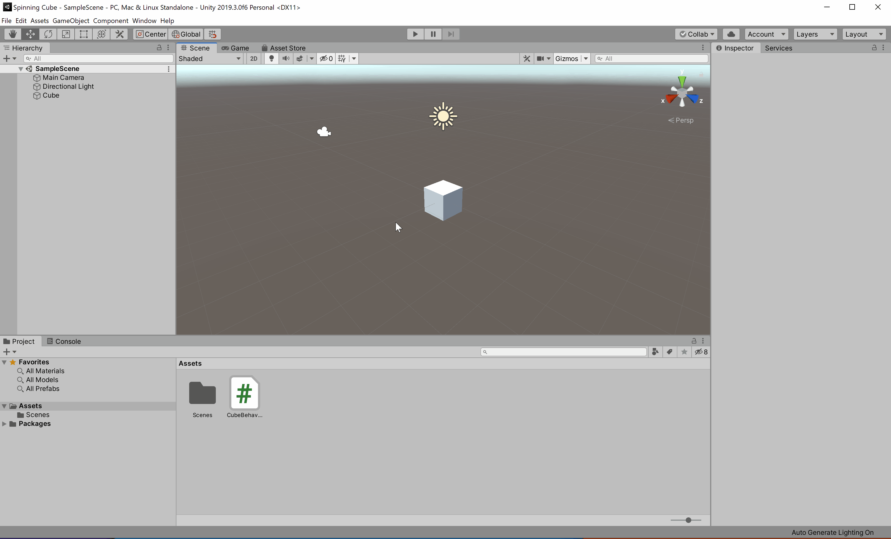
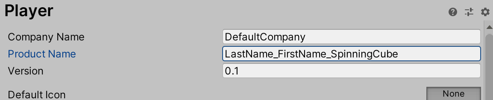
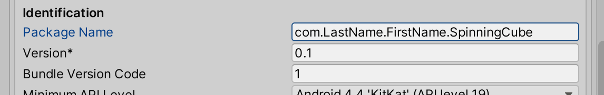
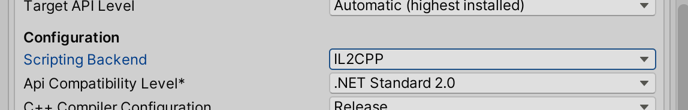
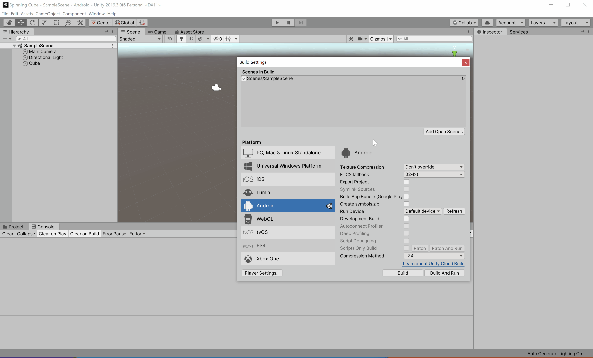

# Project 0: Spinning Cube

## Part 3a: Building and Deploying to Android

### Setting the Settings

Now that we know the project works in the editor, let's go ahead and set it up to be built. First we have to add our scene to the build. Navigate to `File` -> `Build Settings` and in the new window that pops up, click on the _**Add Open Scenes**_ button. Next, switch the target platform to _**Android**_. Finally, we have to change a few _**Player Settings**_. Note that most _**Player Settings**_ are platform-specific (i.e. you have a different set of player settings for Android, iOS, etc.).

#### Identification Settings

The _**Product Name**_ is the name of the app that you will see when it is installed to your phone. Go ahead and set this to `LastName_FirstName_SpinningCube`.

The _**Package Name**_ is your app's unique identifier on your phone and the Play Store. Set this to `com.LastName.FirstName.SpinningCube`.

While you should always make sure to modify these settings appropriately, it is especially important to do so in the context of the projects for this class as it makes it much easier for us to grade. Consider the following two scenarios:

* If everyone had the same package name, then our phones would think that they were all the same app. This would mean that we could only have one student's app on our phone at a time, since trying to install another student's app would overwrite the original app. By having a unique package name, we can install everyone's apps on our phones all at once, thus allowing us to save time, be more efficient, and ultimately get grades back to you faster.
* If everyone had changed their package name correctly but left the product name the same, then our phones would recognize everyone's app as a different app and thus we would be allowed to have them all on our phone at once. However, we would be unable to tell whose app we are using/grading, since all of the apps would show up on our phone with the exact same name (as if you had the same app installed multiple times).

#### Scripting Backend

On Android, Unity gives you the option to use either the _**Mono**_ or the _**IL2CPP**_ scripting backend. However, on iOS there is only one scripting backend option: IL2CPP. As a result, we will be using the IL2CPP option in this class.

IL2CPP (Intermediate Language To C++) is a scripting backend that was developed by Unity to increase the performance, security, and platform compatibility of Unity projects. Essentially, when you start a build, it takes the your project and the C# code that you write and converts it into a native C++ project. This code is then compiled into the native executable for the platform, like an `.apk` file for Android or an `.exe` file for Windows, or used to generate a native C++ solution for compilation by a specific proprietary tool, like an XCode project for iOS or a Visual Studio project for HoloLens.

If you're interested in learning more about how Il2CPP works, check out these optional resources:

* [How IL2CPP works (Unity Docs)](https://docs.unity3d.com/Manual/IL2CPP-HowItWorks.html)
* [Article on IL2CPP](https://www.what-could-possibly-go-wrong.com/il2cpp/)
* [Video of talk on IL2CPP](https://youtu.be/8ExNwDpgRN8)

Go ahead and change the scripting backend option to _**IL2CPP**_.

### Connecting Your Phone

You will need to have _**Developer Options**_ and _**USB debugging**_ enabled on your Android phone in order to install apps from your computer. Instructions on how to do this can be found on the [Android Developers site](https://developer.android.com/studio/debug/dev-options#enable). _NOTE: Instructions may vary slightly depending on your phone model and Android OS version._

Once you have done this, connect your phone to your computer with your cable. You should see a pop up on your phone that asks whether you want to allow USB debugging along with your computer's RSA key fingerprint. Go ahead and click _**OK**_.

### Building and Deploying the Project

Return to your _**Build Settings**_ window in Unity and click on the _**Build And Run**_ button. Create a "Builds" folder in the root of yoru project, create another folder called "Android" for your Android builds, and finally save your apk in there as `LastName_FirstName_SpinningCube.apk`. It is good practice to store your builds in a "Build" or "Builds" folder, as anything in those folders are ignored by Git with the default Unity `.gitignore` file (this will be explained further in the final section).

_NOTE: If you don't have an Android phone, you can still build the apk without deploying to an actual device by clicking the_ **Build** _button instead of the_ **Build And Run** _button._

Once the project has finished building, it will automatically install and launch on your phone.

## [Previous Section](../create-project)| [Go Home](..) | [Next Section](../build-ios)
