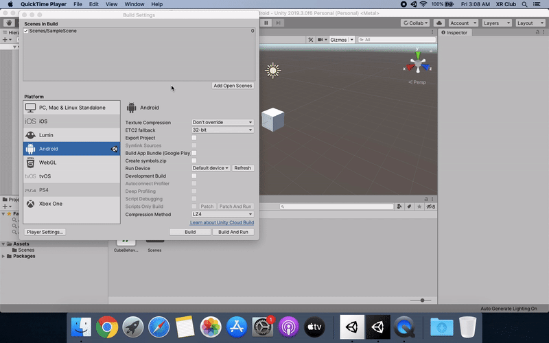
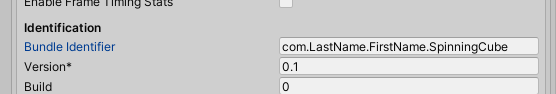
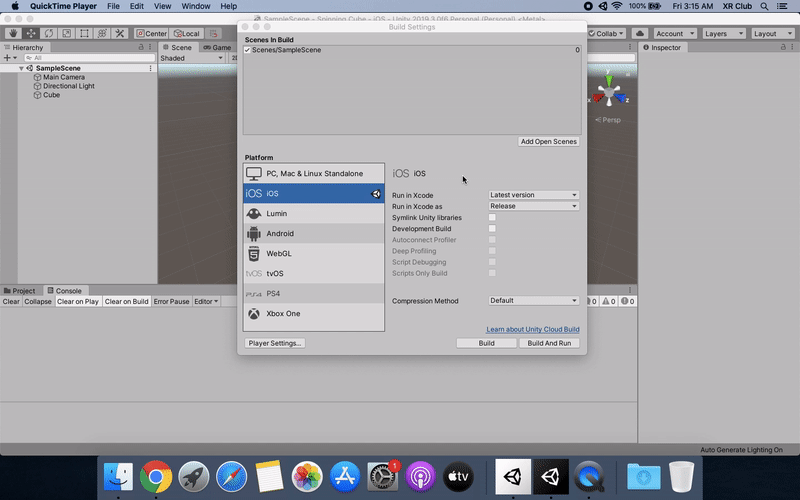
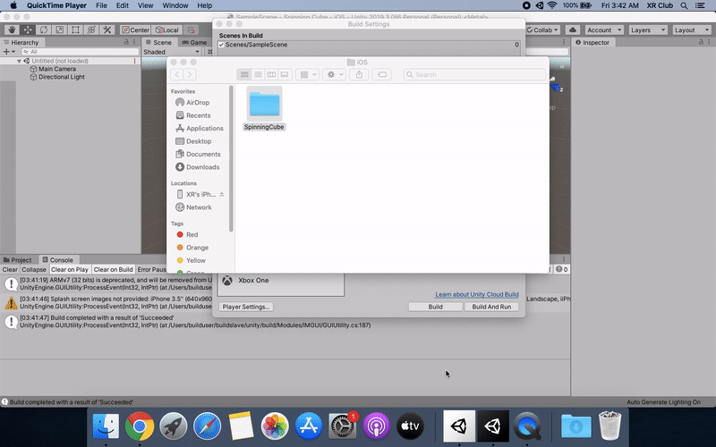
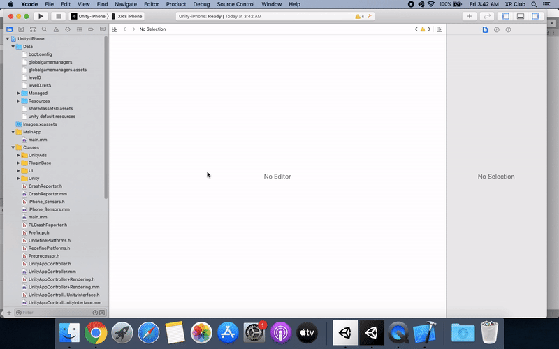
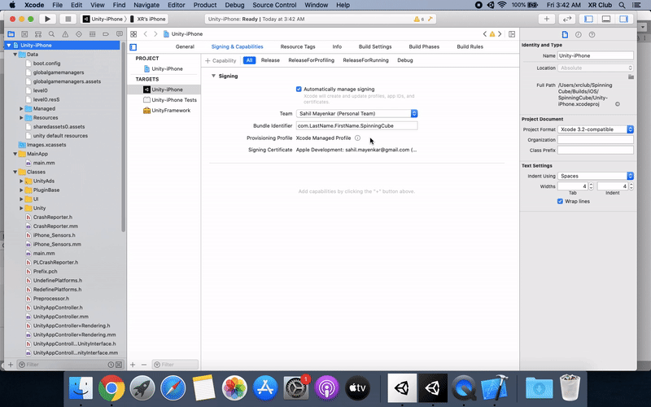

# Project 0: Spinning Cube

## Part 3b: Building and Deploying to iOS (Optional)

### Generating the Xcode Project

First, go to your _**Build Settings**_ window in Unity and change the target platform to iOS. Then, open up the _**Player Settings**_ for the iOS platform.

The product name is one of the few settings that is shared between platforms, so it should already be set to `LastName_FirstName_SpinningCube` from the steps you completed in the last part. However, you will need to set the bundle identifier. Similar to Android's package name, the bundle identifier is an app's unique identifier within Apple's ecosystem. Go ahead and set this to `com.LastName.FirstName.SpinningCube`.

Next, click on the _**Build**_ button, and save your project within the "Builds" folder you previous created, perhaps by creating a new "iOS" folder within it to differentiate it from the Android builds.

_NOTE: You cannot simply hit the_ **Build and Run** _button from Unity as you do with Android phones since there are some additional steps that must be completed in Xcode in order for the app to successfully deploy to your iPhone._

At this point, you should connect your iPhone to your Mac with the lightning cable. Once Unity has finished generating the build, it will open up a new Finder window at the location where you saved your project. Navigate into the project directory and find the file entitled `Unity-iPhone.xcodeproj`. Double click on this to open up the Xcode project. Verify that your iPhone has been automatically selected on the bar at the top.

### Signing the App

In the project navigation pane, click on _**Unity-iPhone**_ to pull up the overall project settings. Next, click on the _**Signing & Capabilities**_ tab and allow Xcode to automatically manage the signing process. Finally, select your Apple ID as the development team.

### Deploying to a Device

Now, all you have to do is click on the play button in the upper left corner. Do not worry if there are many warnings, almost all Unity projects will have these, including an empty project. As long as everything successfully compiles and builds, you should be good to go.

Since this is the first time you are deploying this app, you may get the error shown in the screenshot below. The app has been successfully installed onto your iPhone, however, you cannot open it since your iPhone does not trust your development certificate. You can easily fix this by opening up the _**Settings**_ app on your phone and following the steps outlined in the error. Once you do this, you should be able to launch the app by tapping on it.

## [Previous Section](../build-android) | [Go Home](..) | [Next Section](../debugging)
