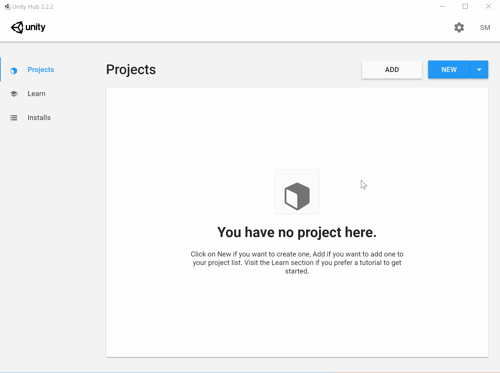
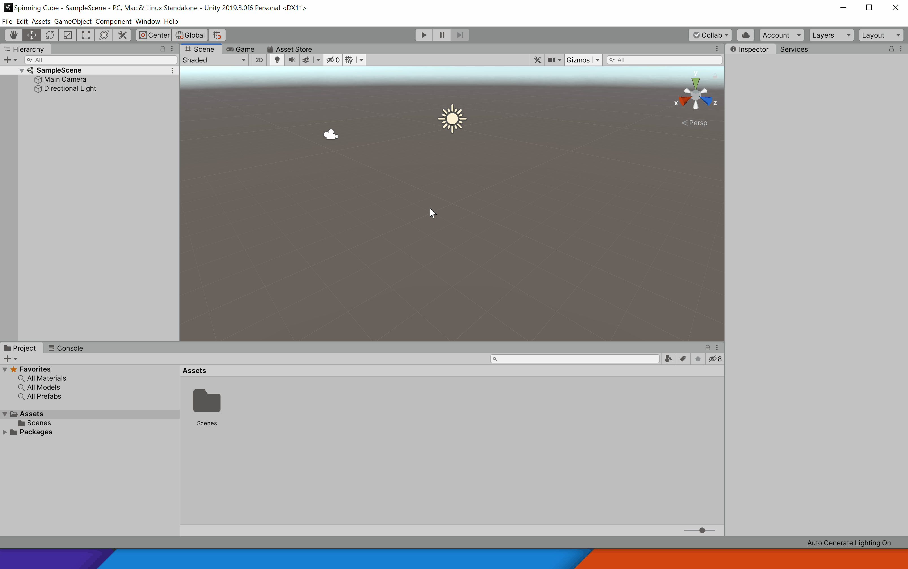
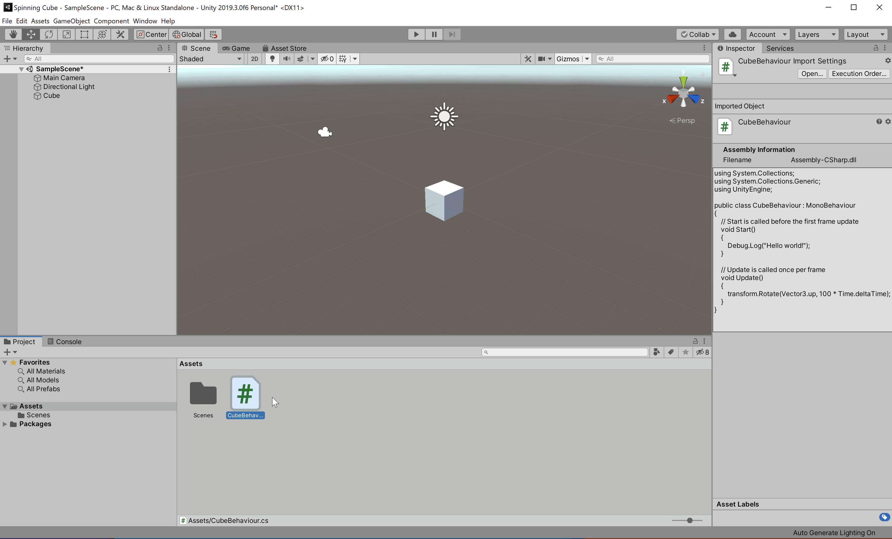

# Project 0: Spinning Cube

## Part 2: Creating Your First Project

### Initializing a New Project

Open up the Unity Hub, make sure you are on the _**Projects**_ tab, and click on the _**New**_ button. In the new window that pops up, make sure the _**3D**_ template is selected and enter "Spinning Cube" as the project name. Select a new location to save your project in, if you would like.



### Setting Up the Cube

By now you should see the Unity editor open, along with a sample scene that was automatically added to your project. There doesn't seem to be much going on here, so let's add a cube to it.

On the menu bar, go to `GameObject` -> `3D Object` -> `Cube`. A cube will now appear in the center of the scene. Let's make it do something, perhaps spin as the name of this section suggests. In the inspector, click on the _**Add Component**_ button and add a new script with the name "CubeBehaviour". You will now see that the C# file appears in our Assets folder. Double click it to launch your favorite code editor.



You will see that two functions were automatically generated for you in the script: _**Start**_ and _**Update**_. _**Start**_ is called before the first frame whereas _**Update**_ is called every frame. 

The following line of code will print "Hello world!" into the Unity Editor's console at the start of your program. The Debug class contains many static methods to log errors, exceptions, warnings, and messages to the console. These can be especially helpful when you're running your program and are trying to figure out what is happening behind the scenes in order to debug unexpected behavior. Go ahead and copy this code into your _**Start**_ function.

```c#
Debug.Log("Hello world!");
```

The following line of code will rotate the cube steadily with each passing frame. Copy it into your _**Update**_ function.

```c#
transform.Rotate(Vector3.up, 100 * Time.deltaTime);
```

Make sure to save your script once you've edited it.

**Note:** Much of what we've described in this section may be confusing and unfamiliar to you, but don't worry! We'll go over the Unity terminology, organization, and life cycle in more detail during our next class session.

### Testing the Project

We've done a lot since we first created this project. Let's make sure to save our scene (`Ctrl+S` (Windows) / `⌘Cmd+S` (Mac) or `File` -> `Save`). You'll know it has saved once the asterisk by the scene name disappears.

Next, make sure the console tab is showing (so that you'll be able to see the output of your debug message) and click the play button to see your work in action.



### Bonus Tasks (Optional)

* See if you can change the color of the cube. _(Hint: Look into materials)_
* See if you can change the color of the cube over time. _(Hint: Use a script)_
* Be creative. Experiment. Test things out.

## [Previous Section](../setup) | [Go Home](..) | [Next Section](../build-android)
