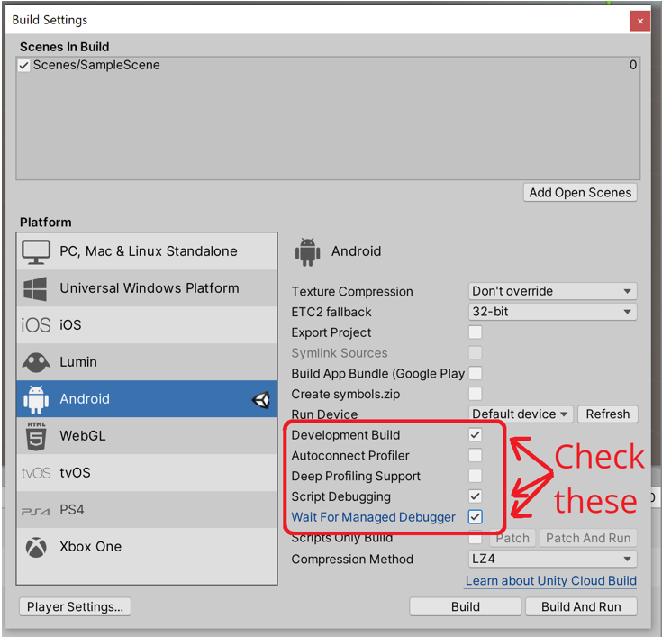
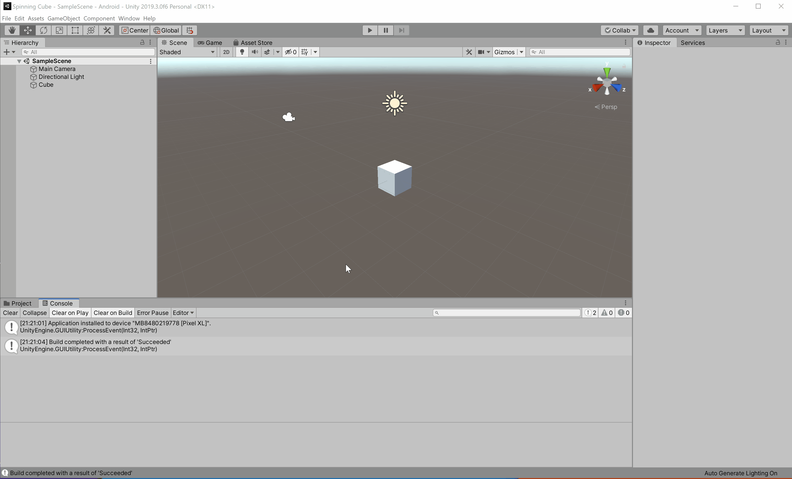

# Project 0: Spinning Cube

## Part 4: Debugging a Build

So far we've been able to test projects from the Editor and receive debug messages, and we've also been able to successfully deploy and run projects on our phones but without seeing the Debug messages. But what if you're in a situation where everything seems to work fine in the editor but not on your phone. Or what if you're dealing with an app that is just hard to test in the editor, for example an AR app that needs to access the phone's camera and underlying AR platform or a VR app that uses motion controllers? Luckily, you can still receive debug messages in the Unity Editor console from a development build of the app running on your phone. Let's test this out.

Open the _**Build Settings**_ window and select the following options:

* Development Build
* Script Debugging
* Wait for Managed Debugger
  - _NOTE: This will only show up as an option once Script Debugging has been selected._

While the image below shows an example of the correct development build settings on an Android target, the same options exist for the iOS build settings as well.

Now you can build and deploy your app as you normally would. Since you are switching between a non-development and development build, it is a good idea to uninstall the app from your phone before proceeding. Once again, even if you are building for your iOS device, you should generate an Android build as well for your submission. Make sure to name this apk `LastName_FirstName_SpinningCube_Debug.apk`.

Once the app launches on your phone, you will arrive at the following screen.

At this point, you should set the Unity Editor console to show output from the Android/iOS device. Once you have done this, click the _**OK**_ button on your phone. Once your scene loads, you will see your "Hello world!" message appear in the console.

## [Previous Section](../build-ios) | [Go Home](..) | [Next Section](../submission)
