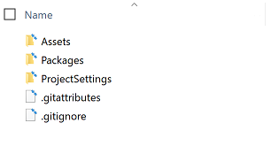
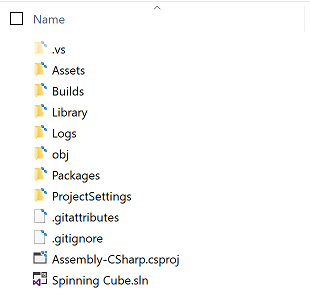
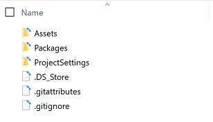

# Project 0: Spinning Cube

## Part 6: The Importance of Correctly Using Git for Submissions

_NOTE: In order to ensure that you have fully read through and understand this section, there is a quiz on ELMS that you must complete by the project 0 deadline. The quiz is infinitely retakeable, so there is no reason why you shouldn't get a 100% on it. Note that while it shows up as ungraded in ELMS, your score on the quiz will be factored into your overall project 0 grade._

A common question that students may have after completing the last section is: _"Why do I have to use git? Can't I just zip my folder directly?"_. This is certainly a very fair question to ask and is one that we hope to address in this section.

### Why Correct Git Usage is Important in General

Version control is an integral part of the software development process, as it is used to keep track of changes made to software and to collaborate with other members in a team. Almost all projects, from those at small startups to large commercial projects to open source software, use some form of version control, and it is likely a skill that you will be expected to use in your jobs and internships. Git is one of the most commonly used version control systems for software projects. Check out these linked resources if you want a more detailed overview of what [version control](https://git-scm.com/book/en/v2/Getting-Started-About-Version-Control) and [Git](https://git-scm.com/book/en/v2/Getting-Started-What-is-Git%3F) are.

For the rest of this subsection, we'll look into the importance of _correct_ git usage, with an emphasis in the context of Unity projects as well as this class. 

#### Cache and Temp Files

When you open up and work with a project in Unity (as well as with Visual Studio), it will generate many library, cache, and temporary files. These files aren't directly relevant to the code you write or the project you're creating, but they can be useful to the tools since Unity/VS can make use of them to run in a more efficient and optimized way on your system. However, these files can add complexity to sharing your project with others, since there can be thousands (or more) of such files!

Luckily, you don't neeed to share these files, since they will already be automatically regenerated by Unity and Visual Studio. The `.gitignore` file that you used (linked [here](https://github.com/cmsc388M/spring20/blob/master/gitfiles/.gitignore)) defines these files that aren't relevant to your project and thus shouldn't tracked by git. As a result, git will ignore the files outlined in the `.gitignore` when you add and commit your changes, and since the zip file you generate with the `git archive` command is based on your latest commit, the zip it generates will also not contain those files.

To understand why this is so important (especially in regards to this class), let's take a look at a real example from last semester's VR project. Consider two real students: Student A and Student B. Student A followed the instructions for using git to correctly generate a zip file. However, Student B did not use git to generate his/her zip file. Below are the stats about their submissions:

Comparison Metric | Student A | Student B
----------------- | --------- | ---------
Total Size of Zip | 387 MB | 1.82 GB
Number of Files in Zip | ~1,500 | ~90,000
Time to Extract Zip | 45 secs | 29 mins

These differences are truly mindblowing! Imagine if we had to spend 5 times longer downloading the zip file and 29 minutes extracting it _for every student's project_. And this is before we even open anything in Unity! It would be almost impossible for us to grade everyone's submissions in a timely manner.

Additionally, these metrics don't even account for all the extra time it must've taken Student B to 1) create their zip file and 2) upload it onto ELMS. Spending a minute or two to correctly enter a few simple commands would've easily fixed this.

One thing to note is that the use of a `.gitignore` file is _not_ unique to Unity projects; in fact you can find the standard `.gitignore` files for practically any type of project [here](https://github.com/github/gitignore). In Python projects, you may see an automatically generated `__pycache__` folder, and in Java projects, you may see `.class` files that contain the bytecode that can be run on the JVM. Neither of these contain your specific code, as that only exist in the `.py` or `.java` files. However, they don't have anywhere near as much overhead compared to what is generated with Unity projects.

#### Operating System Files

Similar to the previous point, your operating system can also automatically generate some files in folders to store certain information and help it run more efficiently. An example of this is `.DS_Store` files on Macs. These are used by the Finder (file explorer) for custom attributes of the folder, such as your custom positioning of icons or the choice of a background image. However, these aren't really relevant to any Unity project, or even any kind of software project for that matter. Rather than add these files to the rules every `.gitignore` for every git project you may work with, you can simply configure your git to automatically apply a global gitignore every time you use git on your computer, in addition to project-specific ones. This is what you should have already completed in [the first section of this project](../setup/#git-setup).

For more info on this, check out [this article](https://augustl.com/blog/2009/global_gitignores/).

#### Binary Files

Git is works very well and efficiently at tracking the changes and history of text-based files. This makes it very useful when working with code, like with Java, HTML, Ruby, JSON, or C# files.

Unfortunately, it does not translate as well to binary files, and it deals with them inefficiently and just takes up extra space. This is a problem because unlike the console-based programs from some of your other CS classes, you may deal with many binary files in Unity projects, including images, sound files, 3D models, and more. Luckily, Git Large File Support (LFS) was a more recent development designed to solve this problem. One purpose of the `.gitattributes` file (linked [here](https://github.com/cmsc388M/spring20/blob/master/gitfiles/.gitattributes)) that you use with each project is to define the file types that Git should use Git LFS for.

Check out this resource if you want to learn more about how [Git LFS](https://www.atlassian.com/git/tutorials/git-lfs) works.

#### Merge Conflicts

Merge conflicts can occur when two people are editing the same file and they both push their changes to the server where their repo is stored (this is a bit oversimplified, but it's good enough for the context of this course and to illustrate the point). In some instances, Git can automatically merge the changes, but other times it may need a human to manually review and resolve the conflicts. Unfortunately, due to the nature of Unity projects, a lot of the merge conflicts can break projects and can be very difficult or even impossible to resolve. Luckily, Git LFS can already handle full file merges for binary files, such as a new version of an image (at least based on how it is defined in the `.gitattributes` file). However, there are some text-based (i.e. non-binary) Unity-specific files that are stored in a special format that don't really work well with Git merges. Luckily, Unity has a tool called UnityYAMLMerge (a.k.a Smart Merge) that is used to properly handle merging on third party verison control systems, like Git. Another purpose of the `.gitattributes` file that you used is to define the file types whose merge conflicts should be resolved using this tool instead of Git's default.

Making sure that you correctly use the `.gitattributes` file is going to be especially important once you start working on your final project. One group learned this the hard way last semester on the day before it was due, and had to stay up all night manually re-doing everyone's changes on a single person's instance of the project.

#### Wrap Up

Hopefully, this subsection has given you an understanding of why we use Git to generate our project as well as how to correctly use Git with Unity. If you're interested in learning more about this, check out [this article](https://thoughtbot.com/blog/how-to-git-with-unity).

In the next subsections, we'll take a look at the contents of some example zip submissions and some common mistakes to avoid.

### Example of a Correctly Generated Zip

Below is an example of the contents of a correctly generated zip file. Nearly all your project zip submissions should look _**exactly**_ like this.



### Examples of Common Mistakes

#### Not Using Git (or gitfiles)

Below is an example of the contents of a zip that was created with the system's file explorer (i.e. not using git). Note that you could have also arrived at this result if you used all of the correct git commands but forgot to add the `.gitignore` and `.gitattributes` files before doing so, which then defeats the points of using git to generate your zip in the first place.


#### Adding gitfiles After Unsuccessful Attempt

Consider the following scenario: You finish your project, create the git repo, and add and commit all of your project's files. However, you then catch your breath and realize that you forgot to add the `.gitignore` and `.gitattributes` files. So you go back and add them to your project, add and commit this change, and finally generate your zip, with this narrow clutch saving the day.

Unfortuantely, this approach will not fix the error, as shown in the screenshot below. When you add or make changes to a .gitignore or .gitattributes file in your project, it will only kick into affect for future commits and will leave past commits unchanged.



There are two ways to fix this problem:

* **Method 1** _(when you have a remote repository on an external server and/or you care about commit history)_
  - Move all of the project files out of the repo into a temporary location.
  - Add and commit all changes to the repo. This will essentially make it look as though you have deleted the project from the repo.
  - Add all of the project files back into the repo, including the `.gitignore` and `.gitattributes` files in the correct locations.
  - Add and commit all changes again to the repo. This will correctly add all of the project files, following the rules outlined in the `.gitignore` file
* **Method 2** _(when you are only using git locally and don't care about commit history)_
  - Delete the `.git` folder of your repo. Note that this may be a hidden folder.
  - Follow the instructions from [part 5](../submission) to create a new git repo and generate the zip.

#### Forgetting to Add and Commit Latest Changes

The `git archive` command only generates the zip file based on the latest commit. If you make a change to your project after your latest commit and then try to create your zip file, it will _**not**_ contain those newest changes and all your hard work will be lost _**unless**_ you add and commit them to your repo _before_ generating the zip.

#### Incorrect Naming of Zip

The reason that we ask you to name your zip file `LastName_FirstName_ProjectName.zip` is because:

* The Unity Hub considers the root folder's name as the project's name. Thus, if everyone's zip was called `Spinning Cube.zip` (and thus the extracted folder would automatically be called `Spinning Cube`, `Spinning Cube (1)`, etc. by default), then it would be difficult for us to keep track of who's project we are working with.
* We could certainly just rename everyone's folders ourselves before opening the projects in Unity, but it is just much simpler if everyone spends a few seconds correctly naming the zip file. That way we can get grades back to you faster, rather than wasting time renaming everyone's submissions.

#### Archiving from Incorrect Location

One common mistake that some people make is that they enter the git archive command from the parent directory of the project. In many cases, the parent directory is not a git repo, and thus they receive the following error:

```
> git archive -o LastName_FirstName_SpinningCube.zip HEAD
fatal: not a git repository (or any of the parent directories): .git
```

This is an easy fix and serves as a good reminder to navigate into the project root folder before generating the zip.

However, in some cases, a student may choose to create their project within another git repo, for example if they cloned the git repo for this class and created their project within there. In such a case, an error would not be returned and a zip file would be successfully created. However, the zip's contents would be from the perspective of that parent directory and would unnecessarily contain all of the other files within that directory (as of the latest commit). You may still have your project within there (with all the gitignore rules correctly applied), however, its folder would be named whatever you had called your project on your computer (i.e. "Spinning Cube"), which leads back to the [pervious point](#incorrect-naming-of-zip).

#### Not Setting Global gitignore for OS Files

This one was already talked about [above](#operating-system-files). Below is an example of the contents of an otherwise correct zip file.



#### Not Building to a _"Build"_ or _"Builds"_ Folder

It is a good practice to keep your builds separate from the project, and thus the "Build" and "Builds" folders are ignored as per the rules of the `.gitignore` file. This isn't as much of a problem with Android builds, since .apk files are already ignored. However, building for other platforms generates a folder containing another native project to be compiled with another IDE (like an Xcode project for iOS or a Visual Studio project for HoloLens), a folder that likely isn't already defined in the `.gitignore` folder. Additionally, even if you were to keep that other project folder within your Unity file, the IDE you use would likely also generate some noise and unnecesssary files and that project would need its own `.gitignore` file.

### How to Make Sure Your Submission is Correct

In almost all classes, you are responsible for making sure that your submission is correct. If you are submitting a paper for a class, _you_ are responsible for making sure you don't accidentally submit the wrong file. In other CS classes that use the submit server, _you_ are responsible for making sure that your project was submitted and compiled successfully on the server, regardless of whether it works correctly on your own machine. Similarly in this class, _you_ are responsible for making sure that your project's zip file contains exactly what you want us to grade.

There is an easy way to test if the zip file that you submit on ELMS is in fact what you want us to see and grade. After you have submitted, you can download your submission, extract it, and open it up in Unity to test that it contains all of your custom assets, plays correctly in the Editor, has all your player settings applied, etc. This process should take less than 5 minutes. Double checking your submission in this manner goes a long way in making sure you're not losing points due to simple mistakes.

## [Previous Section](../submission) | [Go Home](..)
