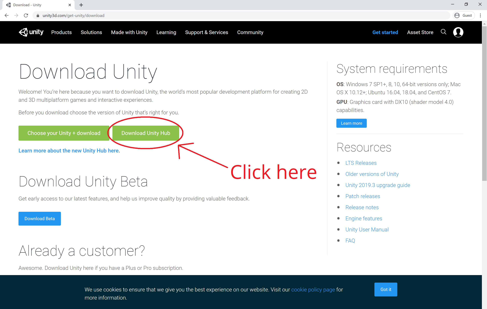

# Project 0: Spinning Cube

## Part 1: Getting Your System Ready

### Creating Your Unity ID

Create your Unity ID account at [https://id.unity.com/](https://id.unity.com/).

### Installing the Unity Hub

Go to [https://unity3d.com/get-unity/download](https://unity3d.com/get-unity/download) and click on the _**Download Unity Hub**_ button. This will start the download for the installer executable file. Launch the Unity Hub once you have finished installing it.



### Activating Your License

Since this is your first time opening the Hub, you will land up at the _**License Management**_ page with a notification message stating, "_You have no valid license._" Click on the profile icon in the upper right corner and sign in to your Unity ID account.


Once you are logged in, you will see that the _**Activate New License**_ button is no longer disabled. Click this button and select _**Unity Personal**_.


### Installing the Unity Editor

_Note: This step could take 30 mins or longer. I would recommend finding something else to do while it downloads and installs in the background._

Click the back button to go to the Hub's main page. Then go to the _**Installs**_ tab and click on the _**Add**_ button. Select the latest official release of Unity and click _**Next**_ to select the modules you want to add. Here is some info about modules of interest for this class:

* Microsoft Visual Studio Community 2019 / Visual Studio for Mac **(Recommended, but optional)**
  - This is the default and recommended code editor for Unity. For more info on supported code editors, see [the next section](#supported-code-editors).
  - If you already have VS 2019 or VS for Mac installed, you should still keep this module checked. It will not add a redundant VS instance but will modify your existing installation to include _**Visual Studio Tools for Unity**_ if you don't already have it installed and will leave it untouched if you do.
  - If you have an older version of Visual Studio installed that you'd like to use instead, uncheck the Visual Studio module in the Unity Hub. Instead open up the Visual Studio installer (should already be installed if you have a VS instance) and modify your existing instance to include the _**Game development with Unity**_ workload. Make sure to uncheck the optional _**Unity 201x.x 64-bit Editor**_ on the installation details, since it is not the most up-to-date version of Unity and we'll be installing Unity separately via the Hub.
* Android Build Support **(Required)**
  - For some of the projects, you will be building and submitting an apk file in addition to your code itself to make it easier for us to test and grade your project. The Android build support module requires a Java JDK and the Android SDK to be installed on your machine. Even if you already have a Java JDK instance on your computer and may have previously installed an Android SDK via Android Studio, it is _**strongly recommended**_ that you install these items via the Unity Hub. Differing JDK and Android SDK versions are often the source of many unexpected and avoidable configuration errors in Unity. Note that installing these via the Hub _will not_ modify your external configurations, as they will just be an additional instance of the JDK and Android SDK to be used solely by Unity.
* iOS Build Support **(Optional)**
  - Select this if you have an iPhone that you would like to build and test your projects on. When you build an iOS project in Unity, it generates an Xcode project that you can then open with the Apple Xcode IDE to deploy to your iOS device. Note that while you can build and generate the Xcode project on Windows systems, the Xcode IDE is only available on Macintosh computers, so you must have a Mac to actually deploy it to an iOS device.
* Documentation **(Recommended)**
  - This will download an offline copy of the Unity documentation onto your computer.

You may have to accept additional terms and conditions before the installation starts. If you are installing this version of Visual Studio on your computer for the first time, make sure to restart your computer after everything finishes installing.


_NOTE: There appears to be a current problem with installing Unity on some Mac computers running macOS 10.15 Catalina where the Hub finishes downloading Unity but immediately exits without actually installing it. If this occurs to you, please follow the instructions at [this post](https://forum.unity.com/threads/unity-hub-cannot-install-unity-when-it-needs-to-elevate-privileges-on-mac.514088/#post-5198375) to resolve the issue._

### Supported Code Editors

Unity supports the following C# IDEs. Make sure you have at least one of them installed.

* [Visual Studio IDE](https://visualstudio.microsoft.com/vs/)
  - This is the default and recommended IDE for Unity scripts and is automatically included by default in your Unity installation.
* [Visual Studio Code](https://code.visualstudio.com/)
  - A popular, lightweight code editor by Microsoft.
* [Rider](https://www.jetbrains.com/rider/)
  - A C# IDE by JetBrains. Its interface is similar to the company's other IDEs, like IntelliJ for Java and PyCharm for Python, and Android Studio, which is powered by IntelliJ. As students, you are able to get a [free license](https://www.jetbrains.com/student/) to this.

### Git Setup

Make sure your computer has both [Git](https://git-scm.com/) and [Git Large File Storage (LFS)](https://git-lfs.github.com/) installed.

Next, create a file called `.gitignore` and place it in a permanent location on your computer. Then navigate to [this website](https://github.com/github/gitignore/tree/master/Global), find the gitignore file that is associated with your operating system, copy its contents into your newly created file, and save. Finally, open your terminal and enter the following command:

```
> git config --global core.excludesfile [INSERT PATH TO YOUR SAVED FILE]/.gitignore
```

We'll go more into the importance of Git LFS and gitignores in the final section of this project.


### Installing the Xcode IDE (Optional)

If you want to build and deploy your apps to iOS devices, you will also need to install Apple's Xcode IDE from the Mac App Store. First, open up the App Store and click on the **Develop** tab. Xcode will be listed as the first app under the _"Essential Apps for Developers"_ list. It is free, so you should be able to **Get** and **Install** it once you navigate to the app page.


Open Xcode once it has finished installing from the App Store. You may have to wait for it to finish installing components. Once it is opened, follow [these steps from the Xcode documentation](https://help.apple.com/xcode/mac/current/#/devaf282080a) to add your Apple ID account to your Xcode preferences.

## [Go Home](..) | [Next Section](../create-project)
