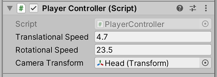

# Project 1A: Barrel Bouncer (Setup)

## Part 4: Allowing Users to Move Around

Whew! You now have your environment laid out. However, if you click the play button to enter Play Mode and try out the game in the Game View, you will notice that you just stay in place and nothing happens, no matter what you do! What good is your beautiful environment if you can't even move around to see it all?

If you exit Play Mode, go back into the Scene View, and hold down the right-click mouse button, you will see that you can easily navigate around the scene using the WASD keys and can use your mouse movements to change the direction you're facing. In this section, you will try to imitate this functionality for use in Play Mode. It may be worth looking at the [project example](https://connect.unity.com/p/cmsc388m-project-1a) once again to get a feel for what you are expected to complete.

Your work in this section will serve as the basis for the player controller, something you will build upon in projects 1B & 1C. A player controller (also known as a character controller) is a component that serves as a link between input from the human user and the main "player" GameObject that the script controls. Its core functionality is to control the player GameObject's movement, but there are many other actions it may define as well. Some common functionalities that a character controller could provide include the ability to...

- move the camera and look around the environment, often via mouse movement or a joystick
- move the player GameObject's position forward, backwards, left, and right, often via the WASD/arrow keys or a left-click on the mouse
- make the player GameObject jump and/or crouch
- restrict player movement, for example to ensure that it does not go through objects or go out-of-bounds
- control any tools, weapons, or special items held by the player GameObject
- keep track of the current player's stats, like health and score

A player controller can define functionality from either a first-person perspective (such as in games like Minecraft or Call of Duty) or a third-person perspective (such as in games like Fortnite, Mario Kart, or League of Legends).

Note that while there are many character controllers available on the asset store and via other sources (including a built-in Unity component), **you are required to implement your own from scratch for this project**.

### Setting Up the Player

Your player will consist of two GameObjects: one for the body and one for the head, with the head parented to the body. This allows both GameObjects to move in different ways, something that would not be possible with a single GameObject (and thus just a single Transform component). This is important because it ensures that the rotations of the head do not affect the body. For example, if the head looks up and down, the body does not bend or slant forwards and backwards as well, but instead still stays upright. At the same time, the head's position is still relative to the body's, and thus it still moves correctly when the whole body moves.

Complete the following steps to set up the player:

1. On the menu bar, click on `GameObject` -> `3D Object` -> `Capsule`. This will create a pill shaped object that you will use as a representation of your character's physical body.
2. Set its position to the origin (0, 0, 0) if it didn't already instantiate at that location.
3. Rename the _**Capsule**_ GameObject to "Player".
4. Set the _**Tag**_ of the _**Player**_ GameObject to _**Player**_.
5. Make the _**Main Camera**_ GameObject a child of this new _**Player**_ GameObject by clicking and dragging the _**Main Camera**_ GameObject onto the _**Player**_ GameObject in the hierarchy.
6. Set the _**Main Camera**_ GameObject's local position to the point (0, 1, 0). This will place it one meter above the center of the _**Player**_ GameObject, which is at the top of the capsule.
7. Rename the _**Main Camera**_ GameObject to "Head".
8. Move the _**Environment**_ GameObject's position so that its center is roughly at the position of the _**Player**_ GameObject and its base/ground is either tangentially touching or almost touching the bottom of the capsule (i.e. the feet of the player). This will ensure that the user is right at the center of the environment when they start the game.
9. Select the _**Player**_ GameObject and then attach a new script called "PlayerController" to it via the _**Add Component**_ button in the Inspector.


You may be wondering why we moved the entire environment, rather than just move the player's position onto an appropriate location in the environment. While it may not make much of a difference now, some XR SDKs rely on the fact that the player starts at position (0, 0, 0) and that the headset has complete control over the player's position and rotation, so it is a good practice to do that now as well.

### Creating the Script

You can now double click on the new script that appears in your project window to open it up in your C# IDE and begin coding!

#### Requirements

The basic requirements for your character controller in this section are:

- It should be first-person.
- When the up/down arrow keys or W/S keys are pressed down the character should move forwards/backwards.
- When the left/right arrow keys or A/D keys are pressed down the character should move left/right.
- The movements described in the last two points should be **relative to the camera, not in global world coordinates.**
- Movements along different axes may be combined. In other words, a user should be able to move diagonally by hitting one of the vertical and one of the horizontal keys at the same time.
- The character should keep moving in the appropriate direction(s) while the corresponding key(s) is held down. It should only stop moving in that direction once the key is no longer pressed, and it must do so as soon as the key is released (i.e. not couple of seconds afterwards).
- When the mouse is moved to the left or right the camera should rotate left or right, and when the mouse is moved up/down the camera should also rotate up/down. Similar to the positional movement, the rotational movement in different directions may be combined.
- Since the mouse translational movement is relative to the camera, if the camera rotates based on mouse input, then the direction of the translational movement should also change at the same time.
- You should be able to edit the speed of translation and the speed of rotation from the Editor.
- You do not have to worry about any other functionality of a character controller for this part. For example, it is perfectly fine if you are able to move through walls.

The GIF below shows the gameplay of a completed project 1A, as well as the effects of the various movements on the Player's and Head's transforms and the Camera in the scene view.


#### Component Properties (Fields)

Your class should have three fields: two floats to control the speeds of the translational and rotational movements of the player and one reference to the _**Transform**_ component of the _**Head**_ GameObject.

The reason you need a reference to the _**Head**_'s _**Transform**_ is that the _**Head**_ is the GameObject that contains the _**Main Camera**_ in the scene that needs to be controlled by the _**Player Controller**_ and the _**Player Controller**_ does not have a way to access the _**Head**_'s _**Tranform**_ by default, since it is on the _**Player**_ GameObject, a completely different GameObject.

Additionally, you should set the default values of the translational and rotational speeds to 1. This will allow you to easily test the default speeds of your movement so you can then decide whether to scale them faster or slower in the Editor.

All of these fields should be public so that you are able access and modify them in the Editor. Below is the code that you should have to define your fields.

```c#
public float translationalSpeed = 1.0f, rotationalSpeed = 1.0f;
public Transform cameraTransform;
```

The image below shows some possible modifications you could make to the fields of this component instance within the Inspector:



#### Important Notes on Your Implementation

In order to use the input system to get input from the mouse and keyboard, you should use method(s) from the Input class (documentation linked [here](https://docs.unity3d.com/ScriptReference/Input.html)) in your code. It is highly suggested that you read through the description in its documentation to figure out how you will get the appropriate input and what you will need to do before starting to code.

In addition to the Input class, **the only Unity classes you are only allowed to use and reference in your implementation for this part of the project are those that are directly related to the items we have discussed in class.** Specifically, you may refer to methods and properties of the [GameObject](https://docs.unity3d.com/ScriptReference/GameObject.html), [Transform](https://docs.unity3d.com/ScriptReference/Transform.html), [Vector3](https://docs.unity3d.com/ScriptReference/Vector3.html), [MonoBehaviour](https://docs.unity3d.com/ScriptReference/MonoBehaviour.html), [MeshFilter](https://docs.unity3d.com/ScriptReference/MeshFilter.html), [MeshRenderer](https://docs.unity3d.com/ScriptReference/MeshRenderer.html), and [Material](https://docs.unity3d.com/ScriptReference/Material.html) classes, though you certainly do not need to refer to all of them. However, you may NOT use references, properties, or methods of other Unity classes in your implementation, such as that of the Rigidbody or the built-in Character Controller. If you do so, we will assume that you must have copied the code from some other source, and at a minimum, you will not receive points for this section.

## [Previous Section](../design-scene) | [Go Home](..) | [Next Section](../submission)
