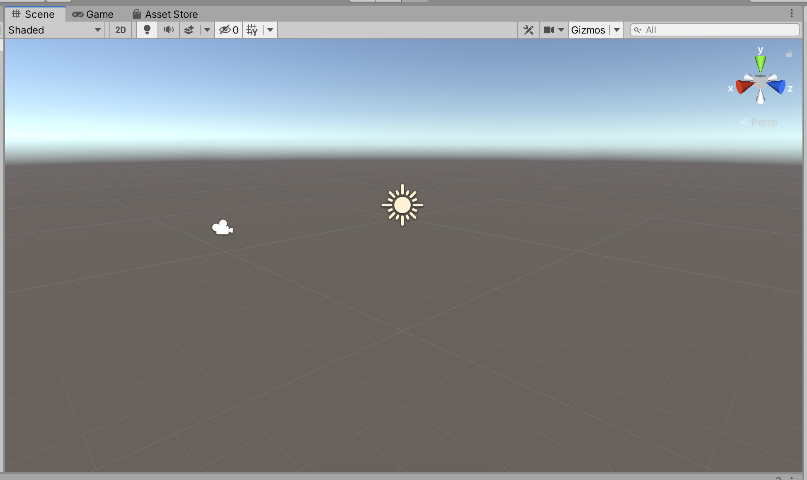
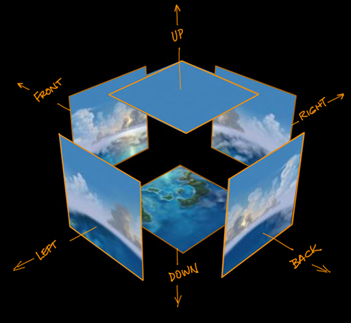

# Project 1A: Barrel Bouncer (Setup)

## Part 3: Designing Your Scene

You should now be able to see all of your models in the Project Window of the Unity Editor. In this section, you'll be placing them into the scene.

### Basic Setup

First, begin with the following steps:

1. On the menu bar, click on `GameObject` -> `Create Empty`.
2. If it isn't already selected in the heirarchy, click on the empty GameObject that appeared in your scene.
3. In the inspector, rename the GameObject to "Environment".

All GameObjects you add to the scene for the rest of this part should be children of the _**Environment**_ GameObject. Note that the default GameObject in the scene (i.e. _**Directional Light**_ and _**Main Camera**_) should not be children of the _**Environment**_ GameObject, nor should the _**Player**_ GameObject that you'll be creating in the next section.

### Adding Your Models to the Scene

Find the files you want to use in the project view and click and drag them into the scene view to place them in your scene. Make sure to parent them to the Environment GameObject.

_(NOTE: For assets that were imported from the Unity Asset Store, they usually contain two versions of the model, sometimes stored in different folders. One is stored as a `.prefab` file, the other is stored as a `.fbx` or `.obj` file. You can distinguish them from the full path & file name that is shown in the project window. You should always use the prefab version of the model when bringing it into your scene.)_

After placing the models you can use the transform tools in the toolbar (such as the Transform, Rotate, and Scale tools) to tweak your scene even more. Remember you can select multiple GameObjects to move them all at once and copy and paste them if you want to have repeated models.

Overall, you should add a minimum of 20 GameObjects into your scene from the models that you imported. If you started with a pre-made sample scene as the basis for your project, none of the GameObjects included in the original version can count towards this 20, and only GameObjects that you add that are of a different type from any of the objects in the pre-made scene will count towards this 20 (in other words, duplicating pre-existing GameObjects or adding other GameObjects of the same model will not count towards the minimum 20).

An important thing to consider when completing this portion is making sure that you place the objects in your scene to scale. As we discussed in class, Unity's default unit is in meters, so thus you should try to think realistically in meters. For example, if you want to place two bushes next to each other, edit their transform's position to be one meter away from each other. If you have to change their positions to be 100 meters away from each other in order for it to look like they are next to each other, then they are probably way too big anyway and you are probably too far away.

While it may not matter as much now when you're just viewing everything through a 2D computer screen, getting into this mindset and doing this correctly will make things easier for you when we get to the VR project, so that, for example, you're not stuck wondering why you can't grab something that looks like it is right in front of you but is actually 5 meters away and way too big.

### Modifying the Skybox

When you create a new scene, you may notice that there is a blue sky with a bright sun in it that reaches out into the horizon, where it meets with a gray, seemingly endless pit that stretches below you, much like the image below. You certainly did not create this, and you can't find it in the Heirarchy, so where did this come from?

It turns out that Unity renderers everything as if you are inside one large cube that is always centered at the main camera and whose inner surfaces contain images that make it look seamless, as shown in the image below. This is known as a "Skybox". In this subsection, you should create your own skybox to fit the vision of your world (for example, if you want a red sky or a starry night).

Unity already has a great step-by-step tutorial on how to make your Skybox and apply it to your scene in their documentation ([found here](https://docs.unity3d.com/Manual/HOWTO-UseSkybox.html)), so we're not going to repeat that here. One thing that you may not be familiar with when reading that is the concept of a texture. All a texture is is an image file; in other words, when you import an image into Unity (such as by dragging it from your OS file explorer into the project window of your editor), it is automatically converted into a texture. In our experience, Unity tends to work best with `.png` files, so you should try to stick to PNG images.

You can find skybox textures to use by searching the [Unity Asset Store](https://assetstore.unity.com/2d/textures-materials/sky?category=2d%2Ftextures-materials%2Fsky&free=true&orderBy=1), [OpenGameArt](https://opengameart.org/art-search?keys=skybox), [TurboSquid](https://www.turbosquid.com/Search/Texture-Maps/free/skybox), or just a regular Google image search for skybox textures. Note that sometimes you may get an image that contains all six faces of the cube in a single image, in that case, you can just create six copies of the image and crop each to represent a different face before importing it into Unity. An additional option could be to create a simple single-colored image for one or more sides, if it makes sense in the context of your world.

### Applying the Final Settings

There are a few final steps left to finish off this section:

- Click on the _**Environment**_ GameObject and then check the _**Static**_ tickmark in the Inspector, since these objects will never move. If you get a message in a popup window that asks if you want to enable the static flags for all the child objects as well, click on the _**Yes, change children**_ button.
- If you have any bodies of water in your scene, you should change its GameObject(s)'s _**Layer**_ to _**4: Water**_ in the Inspector.

### Bonus Tasks (Optional)

- Create a terrain as the ground using Unity's Terrain Tools. Unity's Terrain Tools allow you to start off with a flat plane and then 1) sculpt it to have mountains, hills, valleys, a bumpy surface, etc., 2) paint textures onto its different parts to achieve particular look (i.e. dirt, sand, snow, rocks, etc.), and 3) add grass and trees into the scene with various editable features. This can allow you to create a more cohesive and sophisticated effect. In fact, the base environment from the scene in the [Week 2 lecture example](../../examples/Week2) was created using the Terrain Tools. To learn more about how to use the Terrain Tools, check out these two tutorial ([1](https://youtu.be/aExdxF4OKBo) & [2](https://youtu.be/MWQv2Bagwgk)).
- Add some animations into your scene, perhaps by making a bird flap its wings in the sky or a crab snap its pincers. You can either try to find a pre-animated model or create the animation yourself using Mecanim, Unity's animation system. Check out [the documentation](https://docs.unity3d.com/Manual/AnimationOverview.html) and [this YouTube tutorial](https://youtu.be/NjA_TGH_Mzc) for doing so. Additionally, if you created a terrain with Unity's Terrain Tools, it will allow you to easily add wind effects to make the grass and tree branches sway back and forth.

## [Previous Section](../import-models) | [Go Home](..) | [Next Section](../basic-movement)
