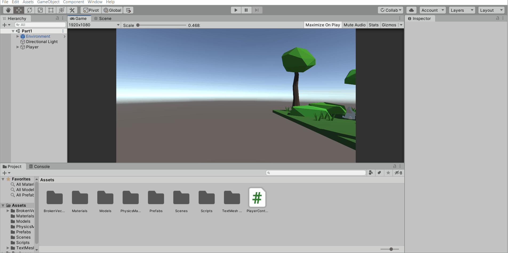

# Project 1A: Barrel Bouncer (Setup)

## Part 2: Finding & Importing 3D Models

Now that you know what you want to build, it is time to obtain the 3D models to design your scene. There are main ways that you can do so: 

- Using the Unity Asset Store
- Downloading from online sites that host 3D models
- Creating your own with a 3D modeling program, like [Blender](https://www.blender.org/) or [Autodesk Maya](https://www.autodesk.com/products/maya/overview)

For this project, you will be importing existing 3D models into your project. While you are welcome to create your own, it is beyond the scope of this class. At a _minimum_, you should:

- Import 8+ unique 3D models
  - 3+ from Unity Asset Store*
  - 3+ from online source(s)*

_* NOTE: Some Asset Store packages or 3D model sources contain multiple models in a single download. Each unique model in the pack may count towards the minimum requirement of 8 total unique models as long as you will use all of them in your scene and they each add to the environment in a meaningful way. **However, the entire package/download only counts as using the Asset Store or an online source once, even if it contains multiple models.** Additionally, if a package already includes a sample scene with an environment, you are only allowed to use it as a starting point **if** you make significant enough changes, and you must save your version as a new scene in the root of the **Assets** folder. You may also just choose not to use a pre-made starting scene that is automatically included in a package and just use the individual 3D models it provides to create your own custom environment from scratch._

Make sure that you keep track of where you are getting your models from. At the end of this assignment, you will be submitting a document that lists out your sources for all the models you imported. A basic list of URLs is fine as long as it is relatively obvious where each model came from. The only exception is if you use a pre-made environment/scene as the basis for building off of; in that case, you will need to tell us where to find the original scene in your project and write a quick one paragraph description of your modifications and additions to the original scene.

Before moving forward, you may want to check out the [bonus tasks in the next section](../design-scene/#bonus-tasks-optional) if you think there's a chance you might want to do them, since they may shape your decisions on which models and props you want to import and which ones may be redundant from the additional tasks you'll complete there.

### Using the Unity Asset Store

The Asset Store is a marketplace for downloading and purchasing assets to use in your project, with everything from UIs to 3D models to tools to SDKs to custom effects and more! For more information on the Asset Store, check out [this guide by Unity](https://unity3d.com/quick-guide-to-unity-asset-store).

To find and import packages on the Asset Store, follow these steps:

1. On the menu bar, click on `Window` -> `Asset Store` to pull up an Asset Store editor window.
2. Use the search bar to look for whatever model you want for your scene.
3. Scroll down and tick the _**Free Assets**_ search filter to refine the results to only show free options.
4. Click on an asset you may want to find out more information on it.
5. If you decide to use the asset, click on the download button and then import the package once that is finished.

### Downloading Models from Online Sources

The Asset Store isn't the only place to get 3D models, so don't worry if there's something you can't find there. In fact, Unity can import any 3D model file stored on your computer, as long as it is in a [supported format](https://docs.unity3d.com/Manual/3D-formats.html). `.fbx` and `.obj` files are some of the most common formats for 3D models, so you should try to look for these.

Below are some popular sites for finding 3D models. Note that some may require you to create a free account in order to download.

- **[Google Poly](https://poly.google.com/)** - One of the best sources for free low poly models.
  - _NOTE: Do **not** use Google's [Poly Toolkit for Unity](https://developers.google.com/poly/develop/toolkit-unity) plugin to import models from this source. Other students in the past have had this cause problems down the line when working with more complex stuff. You should download the model directly from the site as a `.obj` file and import it into Unity using the same method as you would with any of the other sources (described in next paragraph)._
- **[Sketchfab](https://sketchfab.com/)** - Large selection of free and paid models.
- **[Blend Swap](https://www.blendswap.com/)** - A site dedicated to models created with Blender.
- **[NASA](https://nasa3d.arc.nasa.gov/models)** - Great selection of space-related models (obviously).
- **[TurboSquid](https://www.turbosquid.com/Search/3D-Models/free)** - One of the oldest model resources on the internet.
- **[CGTrader](https://www.cgtrader.com/free-3d-models)** - Another source with a large selection of models.
- **[OpenGameArt](https://opengameart.org/art-search-advanced?keys=&field_art_type_tid%5B%5D=10&sort_by=count&sort_order=DESC)** - Great source of free 2D and 3D artwork for games.

Once you find a model you would like to use, make sure to download it onto your computer as one of the supported file formats. Once you do that, you should click and drag the files from your file explorer into the project window on the Unity Editor. If your download consisted of multiple files, make sure you drag them all simultaneously; otherwise Unity might not import the model's textures correctly.

Note that computers running the Windows 10 OS have a pre-installed app called _**3D Viewer**_ that you can use to view a 3D model. This can allow you to verify that the model downloaded correctly with all the textures before you go and import it into Unity.

## [Previous Section](../imagine-world) | [Go Home](..) | [Next Section](../design-scene)
