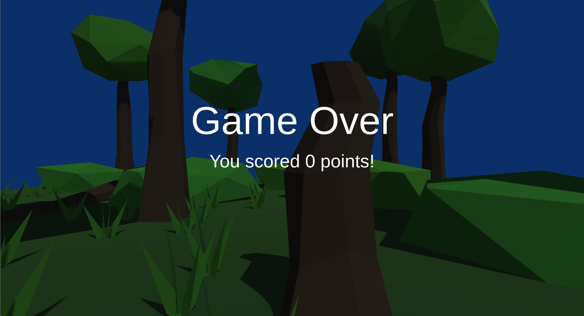

# Project 1C: Barrel Bouncer (UI & Scoring)

## Part 6: Game Over

Once again, you should be able to create your own UIs when given a mockup image. It has been provided again for you below.

There are two ways a game can end:
- A user loses all of their lives.
- A user has destroyed all of the barrels in the scene.
  - This option should only work after a user has spawned at least one barrel during the current game session.

You should define an OnGameOver event in the PlayerController whose subscribed actions take in a single parameter of the final score.

The method that you use to subscribe to the event in your scene switcher script should start a coroutine that accomplishes the following:

- Stop receiving any input from the user. In other words, they should not be able to move the player, look around, throw balls, pause, etc.
- Switch the currently displayed screen to the game over screen.
- Adjust the game over screen's score text to display the final score.
- Wait for 3 seconds before continuing, in order to give the user some time to read the text.
- Go back to the main menu scene.

### Bonus Task (Optional)

- Implement a leaderboard that keeps track of the user's final score and ranks it to all of the other users' final scores. The user can then pull up the leaderboard from the main menu to see where they stand. Additional bonus points if this data is actually saved somewhere so that even if the user returns to the game after having exited the application (or closed out of Unity in your case), they will still be able to pull up the leaderboard once they return to the game.

## [Previous Section](../pausing) | [Go Home](..) | [Next Section](../submission)
