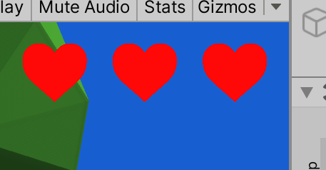

# Project 1C: Barrel Bouncer (UI & Scoring)

## Part 3: A Player's Three Lives

### UI Setup

The steps to set up your UI for this section are as follows:

- Find an icon of a heart with a transparent background and then download and import it into Unity.
- Change the _**Texture Type**_ to “Sprite (2D and UI)” in its the image's import settings and then click the _**Apply**_ button.
- Add an empty GameObject as a child GameObject of the Regular Screen and name it "Lives Container".
- Adjust the following _**Rect Transform**_ properties of the Lives Container:
  - Set its anchor presets, position, and pivot to be at the top right.
  - Give it an small offset on its X and Y positions to move it away from the edges.
  - Set its height to the height that you want your heart images to be in the scene.
- Add a _**Grid Layout Group**_ component to the Lives Container and adjust the following properties:
  - Change the X and Y values of the _**Cell Size**_ to be the same as the height of the Lives Container's _**Rect Transform**_ to give it a square shape. This will automatically set the height and width of any child GameObjects (i.e. each of the heart images). The ability to set the cell size is also the reason why we're using the grid layout group rather than the horizontal layout group.
  - Set an appropriate level of spacing along the X axis so that the hearts won't be touching each other.
  - Give it a _**Constraint**_ of a single "Fixed Row Count". This will ensure that the grid only continues along a straight line rather than overflowing to new rows.
- Add a _**Content Size Fitter**_ component to the Lives Container. Set its _**Horizontal Fit**_ to “Preferred Size" and leave its _**Vertical Fit**_ to “Unconstrained”. This will automatically adjust the width of the Lives Container's _**Rect Transform**_ as child GameObjects are added and removed.
- Create three images as child GameObjects of the Lives Container and set each image's _**Source Image**_ to the heart that you imported.

Your final result might look something like this:

### Scripting Functionality

As you may recall from project 1A, one of the functions of a player controller is to keep track of the current player’s stats, like health and score. Thus you should create an `int` field for keeping track of the remaining lives in your Player Controller and set its initial value to 3.

In project 1B, you set up functionality for the player to "die" if they fall off the edge of the environment. Now, go ahead and decrement the number of remaining lives once this happens. You should also set up an OnDie event and trigger it once the player has died.

Finally, you should add a script to the Lives Container GameObject that subscribes to the OnDie event with a method that destroys one of its child GameObjects. Because of the way we set up the Lives Container, all the remaining hearts will automatically adjust to be positioned correctly (i.e. starting from the right and with correct spacing), and thus it doesn't matter which child GameObject you destroy.

## [Previous Section](../ui-overview) | [Go Home](..) | [Next Section](../scoring)
