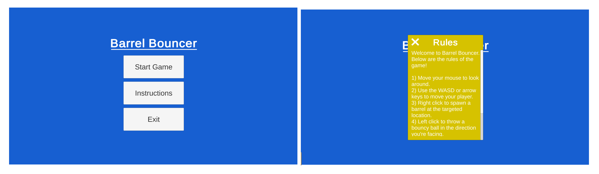

# Project 1C: Barrel Bouncer (UI & Scoring)

## Part 1: The Main Menu

### Creating a New Scene

For most of this project, you've been working with a single scene. However, as we saw in our last lecture, there are several reasons why you might want to use multiple scenes in a compeleted game or application. One such reason is to have a starting scene with a main menu to welcome the user and give them access to various settings, instructions, and other functionality before they begin playing the game. In this section, you will be building out a basic main menu scene for Barrel Bouncer.

To begin, go to your menu bar and click on `File` -> `New Scene`. Then save your scene with a new name, like "StartScene" or "MainMenu". Finally, open up your build settings (`File` -> `Build Settings`) and add your new scene to the build. You should also add your main gameplay scene to the build if it isn't already. Make sure that the main menu is listed first (i.e. at index 0) or drag it up to switch the order if it isn't. It is important that all your scenes are listed in the build; otherwise they won't work with Unity's scene management and you won't be able to load them from other scenes. Additionally, the first scene listed is the one that is automatically loaded when the user starts the game in a built application.

### Building the UI

Next, you should create a screen-space UI for the main menu. Below are some screenshots of what your final result may look like:

Below are the main components of your UI for this scene:

- A background panel that stretches across the entire screen and is set to be a single opaque color.
- Some simple text to display the title. The text should have a large font size, remain centered, and be located above the other components.
- A new empty GameObject called "Button Container". This will be the parent GameObject of all of your buttons. Appropriately adjust its width and height to be the total space you want the buttons to take up.
  - Add a _**Vertical Layout Group**_ component to this GameObject, which allows you to automatically place child UI GameObjects on top of each other without overlapping. Next, select the checkboxes for the _**Control Child Size**_'s "Width" and "Height" as well as the _**Child Force Expand**_'s "Width" and "Height", while leaving everything else unselected. Finally, you should also change the spacing to an appropriate value. These settings will ensure that all the buttons combined will take up the full space of the container and they will each be of the same size and be equally spaced out.
- A button with the text "Start Game". When the user clicks on this button, you should advance to the main gameplay scene.
- A button with the text "Instructions". Clicking on this button should open up the Instructions panel, described below.
- A button with the text "Exit". Clicking on this button should quit your application. Quitting an application can be done with a single line of code. Note that you can't actually exit an application from the Editor and it only works on a built version of the game, so don't worry if you aren't able to test this out.
- Create a background panel for the instructions and give it a different opaque color, since we don't want the items behind to affect its visibility. Note that you should change its anchor points, pivot, and position to be from the center and then adjust its width and height so that it no longer stretch across the entire screen.
- A button that closes out of the instructions when clicked.
  - Make the button an image of a white "X" with a transparent background. You can do this by importing the image into your project (make sure it has a transparent background), changing the _**Texture Type**_ to "Sprite (2D and UI)" in its import settings, applying the settings once you've changed them, and then dragging the image into the _**Source Image**_ property of the _**Image**_ component on the Button. You can then delete the text child GameObject that was created with the button.
  - Change its anchor presets, position, and pivot to be at the upper left of the panel, and then adjust its x and y positions to give it a little bit of offset from the edges.
- Some text to serve as the title of the instructions.
- Create a scroll view for the actual instructions. A scroll view allows you to define a confined space for UI GameObjects to appear and then use horizontal and/or vertical scrollbars to scroll through the content if it they take up too much space.
  - Change the anchor presets, pivot, and position to stretch across the entire panel. Then give it some offset from the top so that you don't scroll over the title or button.
  - We don't want an additional background color on the scroll view, so you can adjust its image's color's opacity to make it transparent.
  - We only want the scroll view to scroll vertically. Thus, you should find the _**Scroll Rect**_ component of the scroll view, uncheck its _**Horizontal**_ property, and set the _**Horizontal Scrollbar**_ reference to None. Additionally, you should delete the "Scrollbar Horizontal" GameObject, which is a child GameObject of the Scroll View.
  - Any items that you want "scrollable" should be child GameObjects of the _**Content**_ GameObject, which is a child GameObject of the _**Viewport**_ GameObject. In order to make the content automatically resize to the height of the GameObjects it contains, add a _**Content Size Fitter**_ component to it with a _**Horizontal Fit**_ to "Unconstrained" and set its _**Vertical Fit**_ to "Preferred Size" as well as a _**Vertical Layout Group**_ with the _**Control Child Size**_'s "Width" and "Height" properties checked and everything else unchecked.
- Some text to contain all the instructions and rules for Barrel Bouncer. It should be on the scroll view's content in order to make it scrollable.

### Background Music

It is also common to have some background music in a welcome scene. Find a music track of your choice and import the file into Unity. Next, create a new GameObject called "Audio Manager", add an _**Audio Source**_ component to it, drag the soundtrack you imported into the _**AudioClip**_ reference, and make sure the _**Play On Awake**_ and _**Loop**_ checkboxes are selected. This will allow the sound to automatically begin playing when the scene starts and also keep repeating the song once it ends. Additionally, you should leave the spatial blend at 2D, since it will not be playing from any specific 3D coordinate in our scene, but rather just provide us with some ambient music.

You should also add a script to your audio manager to give it the following functionality:

- The music to continue across scenes, and thus the GameObject should not be destroyed when the next scene loads.
- The GameObject should follow a singleton design pattern. In other words, there should only ever be one Audio Manager GameObject in a scene at a time. This is especially important to consider since otherwise if a user returns to the main menu scene, a new Audio Manager GameObject will be automatically created in addition to the previous one that hasn't been destoryed, thus causing overlapping music.
- If the user is in the main gameplay scene, the music's volume should be reduced significantly so that the other sound effects from project 1B can be heard as well. If a user returns to the main menu, then the volume should be increased again, since it is the main sound.

## [Previous Section](../notes) | [Go Home](..) | [Next Section](../ui-overview)
