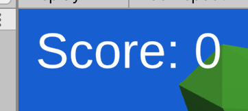
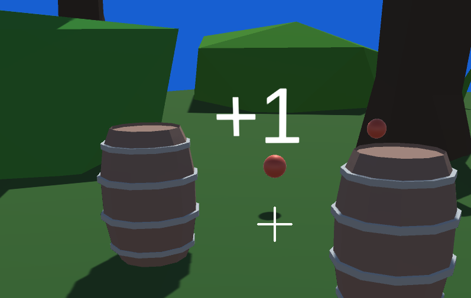

# Project 1C: Barrel Bouncer (UI & Scoring)

## Part 4: Scoring Points

### UI Setup

#### On the Regular Screen

Create some text to display the current score. The initial text displayed should be "Score: 0". Set its anchor presets, position, and pivot to be at the top left and give it a slight offset to push it away from the edges. The image below depicts an example implementation.

Additionally, when you spawned barrels and threw balls in the past right from the center of your screen, you kind of just had to eyeball where they were going to go which made playing the game difficult. Many games and applications handle targeting, aiming, and selecting objects by displaying a "reticle", which can be a dot, plus, or a circle. You should find an image and place a reticle right in the center of the UI screen, as shown in the following image.

#### The World-Space Score Notifier

You should also create a world-space canvas with a some text that says "+1". The canvas should have a script attached to it to make it always face the Player GameObject and also to destroy itself (i.e. the Canvas GameObject) 2 seconds after its creation.

Note that world-space UIs work best when they are very large but are scaled down to be very small (think along the lines of 0.01 or 0.001 scale). Your canvas should be fairly square and the text should take up nearly the whole Canvas. You can place this world-space UI in the scene to adjust its scale and other properties, but once you are done editing it, you should make a prefab out of it and delete any instances of it from your scene.

Your final result might look something like this:

### Scripting Functionality

Similar to part 3, you should add some fields to your player controller to keep track of your current score as well as the number of barrels remaining in the scene. You should increment the latter whenever you create a new barrel.

Next, you should create an OnBarrelDestroyed event from a script on the Barrel prefab. Your player controller should then subscribe to this event so that it can decrement the number of barrels remaining and increment the score when the event is invoked. You should also have a script on your text that subscribes to this event with a method that updates the text with the latest score.

Right before the barrel is destroyed, you should perform two actions.

- Instantiate the world-space score prefab in the location where the barrel was destroyed so that the text "+1" appears at that location. Note that this is the same location from where your explode sound is coming from.
- Invoke the OnBarrelDestroyed event.

### Bonus Task (Optional)

- Currently in your project, you are just increment the score based on the number of barrels you hit. However, many games have more robust scoring systems that incentivize you in multiple ways. Devise and implement your own complex scoring mechanism and update the instructions on the main menu to reflect your new rules as well as all other scoring indicators. In addition to the number of barrels you destroy, some factors that your method could take into consideration include:
  - Accuracy (e.g. the number of balls that hit a barrel / the total number of balls you threw)
  - Distance (e.g. the farther away you are when you throw a ball that hits a barrel, the more points you will receive)
  - Combos (e.g. if you have a single ball destroy multiple barrels, the points gained for each subsequent barrel after the first grow exponentially)

## [Previous Section](../lives) | [Go Home](..) | [Next Section](../pausing)
