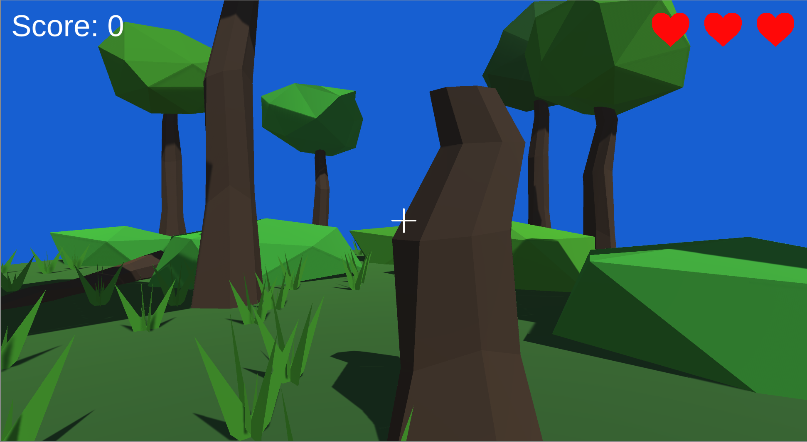
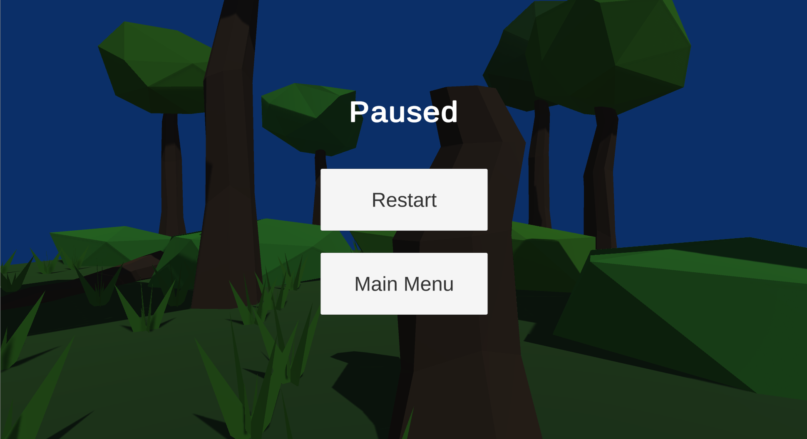

# Project 1C: Barrel Bouncer (UI & Scoring)

## Part 2: An Overview of the Main Gameplay UI

There are three main types of UI screens that the user can see during their gameplay scene. The first is the regular screen, which contains general info they should see all the time, like score and lives. Next is the pause menu screen, which gives options when the game is paused. Finally is the game over screen, which is shown once the game has finished. Below are some screenshots of the three UI screens.

_Regular Screen_

_Pause Menu Screen_

_Game Over Screen_

Note that these are not three different Canvases; rather, they are all just child GameObjects of the Canvas, as outlined below:

- The regular screen should just be an empty GameObject whose anchor presets, position, and pivots stretch across the entire screen.
- The pause menu and game over screens should be panels, each of which should have its anchor presets, position, and pivots stretch across the entire screen (this is already the default for panels, so you may not have to change anything). The panels should be dark and translucent, enough to let the user know that they aren't in the regular gameplay state but at the same time also allow them to see the world in front of them.

All other UI GameObjects that you create for this scene should be descendants of their appropriate "screen" GameObject.

Additionally, only one of these screens should ever be displayed at a time. In order to do this, create a "Screen Switcher" script on the Canvas with references to each of the screens. Then, create three methods, each of which toggles a different screen to be active while making the other ones inactive.

## [Previous Section](../main-menu) | [Go Home](..) | [Next Section](../lives)
