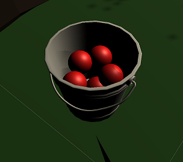

# Project 2: Barrel Bouncer VR Edition

## Part 2: Modifications to Your Environment

In this section, you will be modifying your environment to better fit our new scenario and to optimize it for mobile VR performance.

### A Note About Scale

In project 1A, we discussed that you should design your scene to scale. It is especially important to revisit that point now that we are in the VR unit, and thus we have copied over the relevant paragraph below, for your reference:

_An important thing to consider when completing this portion is making sure that you place the objects in your scene to scale. As we discussed in class, Unity’s default unit is in meters, so thus you should try to think realistically in meters. For example, if you want to place two bushes next to each other, edit their transform’s position to be one meter away from each other. If you have to change their positions to be 100 meters away from each other in order for it to look like they are next to each other, then they are probably way too big anyway and you are probably too far away._

If you did not correctly consider scaling when you initially designed your environment, you will need to go back now and resize everything. If everything is scaled realistically relative to themselves but your environment itself is too big, the easiest way to fix it is to just scale down your _**Environment**_ GameObject, which will then appropriately scale down all its descendant GameObjects since their transforms are defined relative to the _**Environment**_'s. There are a few ways you can determine the best scaling value:

- You could try calculating the appropriate scale yourself using math.
- You could temporarily place a default capsule GameObject into the scene and use it as a reference for how big things should be, since the capsule is a good approximation for the size of a human.
- You could build the game to the headset in order to see what feels too large. Then you could use trial and error to repeat this process and adjust the scales accordingly. Note that you should generate the lighting data, as described [later in this section](#lightmapping), prior to building your `.apk` file. If you do this, you should also make sure to regenerate the data once you are finished modifying your environment so that the lighting is realistic relative to the latest scales and positions of the static GameObjects.

This discussion of realistic scaling and positioning will be important as you modify your environment for the rest of this section as well. For example, you may be able to pick up a ball that is 0.5 meters away from you, but you probably can't pick up a ball that is 5 meters away from you.

### Adding Barrels Into Scene

In this version of the project, you will not be spawning barrels via Raycasting. Rather, they will already be pre-placed within your environment.

For organization, create an empty GameObject centered at origin and name it "Barrels". All the barrels you create should be children of this GameObject. This GameObject should also be at the root level of the hierarchy; it should not be a child of the _**Environment**_ since the barrels should not be static (since the barrels are not always stationary as they can be moved and destroyed in the scene). You should also verify that your barrel prefab is not set to static.

Place 10+ instances of your barrels prefabs into your scene accessible to your player. They should be located on the ground and/or on top of other objects in your environment in a realistic way. Make sure to have them in a variety of distances and directions from the player's initial starting position.

### Creating a Bucket of Balls

Instead of instantiating and throwing balls with the left mouse button, the balls will now be pre-placed into the scene and players will be able to pick them up and throw them with the motion controllers. The balls will be in a bucket, which will be placed right in front of the player and will move with the player. 

1. Find a model of a bucket and import it into your project. You may do so using any of the methods described in project 1A (i.e. Asset Store or online sources), as described [here](https://cmsc388m.github.io/spring20/project1a/import-models/).
2. Place the bucket into the scene as a child GameObject of the _**OVRCameraRig**_, somewhere right in front of the player near their waist level so that they can realistically reach into it. Remember that the y-value defines its height above the ground and the z-value defines how far in front of the player it is, both in meters. Additionally, resize the model if necessary.
3. If you have a script on your ball prefab that destroys the ball 5 seconds after insantiation, comment out that code so that the balls remain in the scene indefinitely. You will handle destroying the ball 5 seconds after its been thrown in a later section.
4. Place 5+ instances of your ball prefab into your scene as child GameObjects of the _**Bucket**_. Once again, the balls should be approximately the size of a tennis ball in order to realistically fit in your hand, so you may need to resize the prefab if necessary if you hadn't done this correctly in project 1B. Additionally, make sure that the balls are all contained within the bucket and are not overlapping with each other.

The final setup of your bucket of balls may look something like this:

One thing to note is that in its current state, the balls will probably just fall to the ground when the app is run. This is because bucket probably doesn't have a collider on it. The problem with just adding a mesh collider to the bucket to fix this is that most meshes would have not properly defined its hollow inner part and thus the collider would just be along its outer surface, making it cylindrical. This means your balls would already be inside of this collider, and its Rigidbodies would try to force itself out of the bucket's collider upon start. There are a few different options on how you could fix that:

- Find a model of a bucket whose mesh properly defines the hollow inner part so that it can be seen in this way by the physics system when you add a mesh collider. If you can't see the green wireframe outline depicting the collider, temporarily disable the _**Mesh Renderer**_ so that you can more easily see if it is there. If the collider still doesn't show, the mesh collider isn't rendering properly in the scene (which could happen with some high-quality models from online sites), and you could try setting the _**Convex**_ property of the Collider, which will simplify the mesh and set the max number of triangles to 255. You could also try looking into the Asset Store to see if there are any bucket prefabs with hollow colliders already set up for you.
- Create your own compound collider of primitives that approximates the shape of the bucket while keeping the inner part hollow.
- Open up your _**Ball**_ prefab and set the _**isKinematic**_ property of the _**Rigidbody**_ component to `true`. The _**isKinematic**_ property controls whether this Rigidbody is affected by the physics system, which means that when it's checked, forces and collisions will not affect the motion or position of that GameObject anymore. This will make the ball float in the air inside the bucket and not be affected by gravity. You can then turn this property off later once you throw the ball.

### Occlusion Culling

Occlusion culling is a performance optimization technique that will only render the GameObjects that you can directly see in your view and ignore everything that you would not be able to see during that frame anyway. In other words, it will not render GameObjects that aren't in the direction of your camera's view nor will it render GameObjects that are hidden behind other GameObjects. To learn more about how occlusion culling works, check out [this section of the Unity Docs](https://docs.unity3d.com/Manual/OcclusionCulling.html).

Note that occlusion culling can only be performed on static GameObjects, as their positions size are constant and known.

In order to apply occlusion culling to your environment, follow these steps:

1. In the menu bar, go to `Window` -> `Rendering` -> `Occlusion Culling`.
2. Click on the _**Bake**_ button at the bottom of the occlusion window.

### Lightmapping

Another optimization that Unity performs to static GameObjects is with lighting: rather than generating all the lighting data in real time during runtime while you play the game, Unity pre-calculates the illumination from the lights and stores this information into a file called a lightmap. This works because static GameObjects will never move, thus it doesn't make sense to have run-time overhead for determining lighting illumination and shadows on your environment every frame when you can just access the data from a file. To learn more about how lightmapping works, check out [this section of the Unity Docs](https://docs.unity3d.com/Manual/Lightmappers.html).

Follow the steps below to generate a lightmap:

1. In the menu bar, go to `Window` -> `Rendering` -> `Lighting Settings`.
2. In the lighting window, scroll down to the _**Lightmapping Settings**_ section and change the _**Lightmap**_ size to the highest value (i.e. 4096). For performance, it is better to have a few large lightmaps, instead of many smaller ones.
3. Unselect the _**Auto Generate**_ checkbox at the bottom of the lighting window and then click on the _**Generate Lighting**_ button. This will create your baked lightmaps.

Note that this subsection could take anywhere from a few minutes to a few hours to complete, depending on the complexity of your environment and the specifications of your machine. **It is highly recommended to have your computer do this task overnight if you have a lot going on in your environment.**

If you still seem to have trouble trying to get the lighting to bake in a reasonable time, you could try adjusting the following lighting settings:

- If you have a discrete graphics card (i.e. NVIDIA GeForce or AMD Radeon), then it may help to change the _**Lightmapper**_ to _**Progressive GPU (Preview)**_ instead of _**Progressive CPU**_. This will allow the computations to take place on the graphics card. To learn more about how the GPU Lightmapper works, check out [this blog post](https://blogs.unity3d.com/2019/05/20/gpu-lightmapper-a-technical-deep-dive/).
- You could try reducing the _**Lightmap Resolution**_. The shadows and lighting may not be as precise, but will still have the same general shape.
- You could reduce the number of _**Direct Samples**_ and _**Indirect Samples**_ that the lightmapper uses for calculations. However, this can result in your GameObjects looking more "noisy". For some examples of how changing the sample values affect how your scene looks, check out the "Tweaking Bake Settings" section of [this page on the Unity Docs](https://docs.unity3d.com/2019.2/Documentation/Manual/Lightmapping.html)

## [Previous Section](../setup) | [Go Home](..) | [Next Section](../locomotion)
