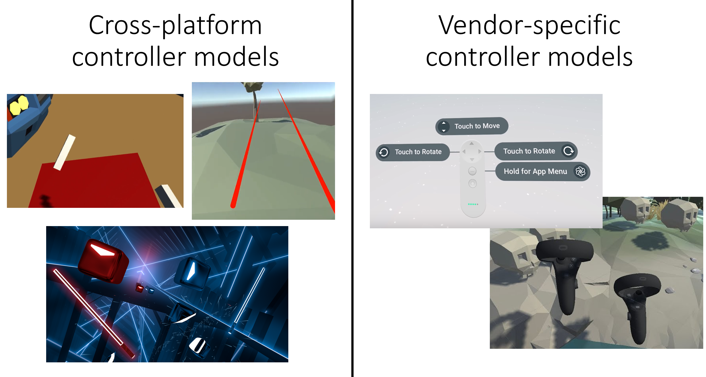

# Project 2: Barrel Bouncer VR Edition

## Part 0: Notes About the SDKs and the Hardware

### Virtual Reality SDKs

When deciding which tools to use to build your VR application in Unity, two particular options emerge: vendor-specific SDKs and Unity's own XR tools.

In the past, Unity's tools mainly consisted of the Unity XR APIs, which enabled cross-platform VR development, allowing for headset tracking and controller input regardless of which supported VR platform you are targeting (i.e. you can have a single codebase that supports Oculus, Gear VR, Google Daydream, Windows Mixed Reality, etc.). However, they were very barebones outside of these basic functionalities and using it required you to implement a lot of other common VR UX mechanisms yourself from scratch.

On the other hand, vendor-specific SDKs typically only supported the vendor's hardware but were more comprehensive. They allowed you to take full advantage of the device's capabilties and often included built-in prefabs and components that took care of a lot of the common UX interactions. This allowed for more rapid development and more consistent experiences within a particular ecosystem. They also typically had better documentation.

Unity quickly realized the problems and inconveniences that developers faced when they used the Unity XR APIs and took this into consideration when they were restructuring their XR framework. Specifically, they created the following tech stack to make it easier to develop cross-platform XR experiences using Unity's own tools:

This new tech stack introduces new developer tools that are designed to make it easier to develop your own cross-platform VR experiences. Their XR Interaction Toolkit in particular provides a set of ready-to-use components that enable common VR UX interactions without the need to write your own code, much like what the vendor-specific SDKs provide.

#### Why Use Vendor SDKs Anymore?

With these new developments on Unity's cross-platform tools, you may be wondering why one would ever use a vendor-specific SDK anymore. One reason is that they contain specific customizations to their own hardware and platforms. An example of this is with the virtual controller models, as shown in the image below. Vendor-specific SDKs often include controller prefabs that contain virtual models of their real controllers. Since the cross-platform apps are not tied to any specific hardware, they usually just contain some generic non-platform-dependent controller visualizations. Neither approach is necessarily better, as there are plenty of apps in the latter category that have created custom controller visuals that fit well into their overall experience, like Beat Saber. Another example is that common UX interactions, like teleportation, created with the prefabs and components of the vendor-specific SDK will have the same visuals and "feel" to them as first-party example apps of the platform, compared to generic versions across all platforms, kind of like how iOS apps have a different "feel" than Android apps. Once again, neither is better as either can be fit into the "experience" you are trying to create.

The second reason is that the vendor-specific SDKs are able to give access to the latest unique features of the vendor's hardware. While Unity does try to integrate all new types of hardware and platform features into its frameworks and developer tools, it often does so at a slower pace than vendors are able to provide with their own tools. One current example of this is with the hand tracking feature of the Oculus Quest, which uses the headset's cameras and computer vision to allow you to interact with virtual objects using your hands (i.e. no controllers).

As part of this course, we want you to get exposure to both using a vendor-specific SDK as well as the Unity's new cross-platform developer tools. Since you will already be using Unity's AR Foundation framework and the XR Interaction Toolkit to implement your AR project, we decided to stick with using the Oculus Integration for the VR project. As such, it may be helpful to bookmark the [Oculus Documentation for Unity](https://developer.oculus.com/documentation/unity/) so that you can reference it as you implement this project.

### The Oculus Quest

You will be developing your Barrel Bouncer VR application for the Oculus Quest, pictured below.

The Oculus Quest is a mobile standalone 6DOF headset by Facebook. It allows you to both look around and walk around a space, thanks to the headset's four cameras that enable its groundbreaking inside-out tracking system called Oculus Insight (see more on how that works [here](https://tech.fb.com/the-story-behind-oculus-insight-technology/)). The Quest also supports two Oculus Touch motion controllers, which allow for a wide range of input.

For more information on the Oculus Quest, check out its [official product page](https://www.oculus.com/quest/).

## [Go Home](..) | [Next Section](../setup)
