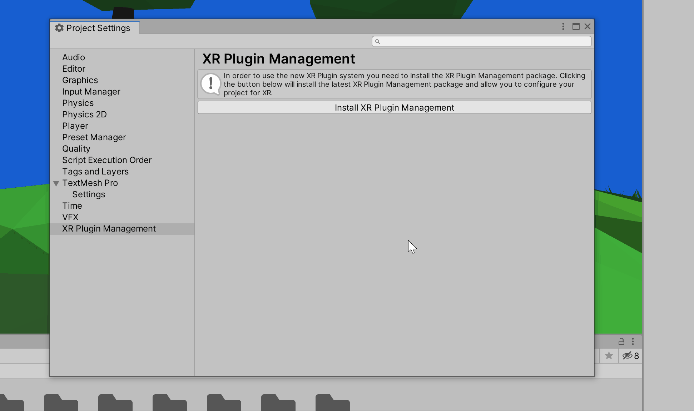
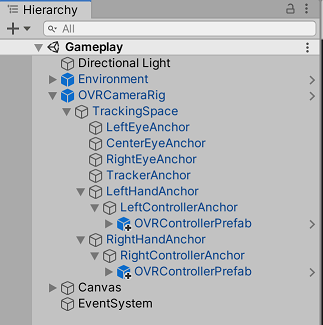

# Project 2: Barrel Bouncer VR Edition

## Part 1: Setting Up Your Project for VR

### Build Settings

First, open up your _**Build Settings**_ and modify the following:

- Uncheck the Main Menu scene from the build so that your Gameplay scene is the only one that is selected. In order to simplify this project and make it easier for you, we have decided to break the game logic flow a little bit so that you are only dealing with one scene.
- Since the Oculus Quest is an Android-based VR headset, you should switch the platform to _**Android**_.
- Change the _**Texture Compression**_ setting to _**ATSC**_. Oculus recommends using this for mobile VR to provide the best balance between quality and file size.

### Player Settings

Next, go in to your _**Player Settings**_ and modify the following:

- **General**
  - **Product Name:** LastName_FirstName_BarrelBouncer_VR
    - _This is the name of the app that you will see when it is installed to the headset._
- **Other Settings**
  - **Rendering**
    - **Multithreaded Rendering:** ✓
      - _This will distribute graphics API calls across multiple threads, which can have a positive effect on CPU intensive applications._
    - **Static Batching:** ✓
    - **Dynamic Batching:** ✓
      - _Batching refers to grouping or combining multiple meshes together so that they share materials and can be drawn on the display with fewer draw calls. Static batching refers to the process of doing this for GameObjects marked as static (or stationary) whereas dynamic batching refers to the process of doing this on non-static GameObjects that could move around. Each is slightly different, as we will discuss in class. For more iinformation, see [this page](https://docs.unity3d.com/Manual/DrawCallBatching.html) on the Unity documentation._
    - **Compute Skinning:** ✓
      - _This setting allows the GPU to take care of skinning animated meshes, thus freeing up the CPU._
  - **Identification**
    - **Package Name:** com.LastName.FirstName.BarrelBouncer.VR
      - _This is your app’s unique identifier on the headset (and the Quest Store)._
    - **Minimum API Level:** Android 6.0 'Marshmallow' (API level 23)
      - _Apps for the Oculus Quest make use of features that were only introduced in Android 6.0, and thus you should set the minimum API level to this._
  - **Configuration**
    - **Scripting Backend:** IL2CPP
      - _The IL2CPP scripting backend has many benefits, as described in [project 0](https://cmsc388m.github.io/spring20/project0/build-android/#scripting-backend). Most notably, it can improve performance and make your app run quicker on the device as compared to the Mono scripting backend._
  - **Optimization**
    - **Prebake Collision Meshes:** ✓
      - _This generates the colliders during build time rather than runtime, which can increase app size but decrease the scene loading times._
    - **Keep Loaded Shaders Alive:** ✓
      - _This can solve problems related to compiling shaders at runtime, but can increase the initial loading times._
    - **Optimize Mesh Data:** ✓
      - _This removes the rendering data during the build that isn't actually used by a mesh's material._
- **XR Settings**
  - _NOTE: Do NOT select any of these options. These refer to Unity's built-in XR platform integrations, which has been deprecated in Unity 2019.3 as they transition over to their new XR plug-in framework that we will be using for this project. Check out [this blog post](https://blogs.unity3d.com/2020/01/24/unity-xr-platform-updates/) for more information on the change._

### Downloading the XR Plugins and SDKs

There are two main tools we will need to obtain to get this project to work with VR: the Oculus XR Plugin, which is installed via Unity's XR Management system, and the Oculus Integration SDK, which is installed via the Asset Store.

#### XR Management and the Oculus XR Plugin

As mentioned above, Unity has a new XR plug-in architecture where you use the XR Management Project Settings to install and load the plugins for the XR platforms you would like your application to support. By default, the XR Management settings are not included in the core Unity Editor, so you will need to install this feature via the Package Manager.

A package is a collection of assets, which are any kind of files supported by Unity (scripts, scenes, materials, 3D models, audio, images, etc.). In the past, you may have used the Asset Store to download packages. Both the Asset Store and Package Manager allow you to import and upgrade packages. The difference between the two is that the Package Manager is primarily used to install optional features of Unity itself into your project, whereas the Asset Store is generally used as a marketplace for specific content that would end up in your project/scene, including UIs, 3D models, tools, SDKs, custom effects, and more.

To install and set up the Oculus XR Plugin, follow the steps below:

1. Open up the _**Package Manager**_ by going to your menu bar and navigating to `Window` -> `Package Manager`.
2. In the new window that pops up, scroll all the way down to the bottom and install the _**XR Management**_ plugin.
3. Once this has installed, go to your menu bar and navigate to `Edit` -> `Project Settings`.
4. In the new window that pops up, click on the _**XR Plugin Management**_ tab and then install the _**Oculus XR Plugin**_.
5. Add the _**Oculus Loader**_ to the list of _**Plugin Providers**_.
6. Click on the _**Input Helpers**_ subtab of the _**Project Settings**_ and then click on the _**Install Legacy Input Helpers Package**_ button.
7. Click on the _**Oculus**_ subtab of the _**Project Settings**_ and then create a new serialized instance of the settings data.
8. Change the _**Stereo Rendering Mode**_ to _**Multiview**_. In Unity, each of the eyes of a VR headset is considered as its own separate camera/display, which can cause redundant computational and graphical workloads and thus significantly reduce performance. The Single Pass Stereo rendering mode provides some optimizations for a VR setup so that both cameras can share some computations and the same GameObjects are rendered onto both displays before iterating on to the next GameObject. Multiview is built on the same infrastructure as Single-Pass Instancing, but relies on the mobile graphics driver's implementation of certain optimizations rather than Unity's. To learn more about Single Pass Stereo rendering, check out [this page](https://docs.unity3d.com/Manual/SinglePassStereoRendering.html) on the Unity documentation.

#### The Oculus Integration

The Oculus Integration is a 3rd-party vendor-specific SDK provided by Oculus and as such can be found on the Asset Store. Once you find the Oculus Integration, download and import it into your project. Note that this step could take 15-30 minutes to complete, so it is advisable to work on something else while this finishes in the background. If you get popups saying that there are newer versions of plugins available, go ahead and select the option to upgrade them.

_NOTE: The Oculus Integration defines its own Player Controller script, which can conflict with the script you defined and thus cause errors. As such, you should rename your script in order to avoid these errors, both by renaming the file itself from the project window and by changing the class name from within the file contents itself._

The Oculus Integration also includes many example scenes that showcase how to implement various VR features and setups using the Oculus Integration's components and prefabs. These example scenes constitute its "Sample Framework". Scenes that are part of the Sample Framework can be found in the following folder: `Assets` -> `Oculus` -> `SampleFramework` -> `Usage`. They may be a useful reference to you as you work on this project.

### Basic Scene Setup

#### Headset Tracking

First, you should delete your _**Player**_ GameObject from your scene and also make sure there are no other Cameras in your scene. The Oculus Integration already contains two prefabs that can act as a Player GameObject: the _**OVRCameraRig**_ and the _**OVRPlayerController**_. For this project, we will use the _**OVRCameraRig**_ prefab as our player GameObject, which is located in `Assets` -> `Oculus` -> `VR` -> `Prefabs`. Go ahead and drag this prefab into your scene and make sure its position and rotation are set to (0, 0, 0).

The _**OVRCameraRig**_ GameObject contains a few important components. The _**OVR Camera Rig**_ component automatically adjusts the player's camera's translational and rotational movement based on the motion of the headset. The _**OVR Manager**_ component provides the main interface to the VR hardware. The _**OVR Headset Emulator**_ is supposed to allow you to simulate headset rotations from within the Unity Editor on your computer, but it only works with Windows and it doesn't seem to work with the latest Unity version anyway.

You will need to set two properties of the _**OVR Manager**_ component:

- **Target Device:** Quest
- **Tracking Origin Type:** Floor Level
  - This allows you to track position and orientation relative to the floor, based on the user's standing height.

#### Controller Tracking

The _**OVR Manager**_ also keeps track of the controllers' movements and then appropriately adjusts the _**LeftControllerAnchor**_ and _**RightControllerAnchor**_ GameObjects to stay in sync with these motions. As a result, any 3D model or GameObject that is a child of the _**LeftControllerAnchor**_ GameObject will also have its position automatically adjusted by the left hand controller's movements, since its transform is defined relative to its parent.

The _**LeftControllerAnchor**_ is a child GameObject of the _**LeftHandAnchor**_ GameObject, which is a a child GameObject of the _**TrackingSpace**_ GameObject, which is a child GameObject of the _**OVRCameraRig**_ GameObject. The _**RightControllerAnchor**_ also has a similar hierarchy structure.

The Oculus Integration also provides an _**OVRControllerPrefab**_, which determines and displays a model of the correct type of controller in your scene based on the type of headset you're using (i.e. Oculus Go controlller, Gear VR controller, Oculus Quest Touch controllers, etc.). The _**OVRControllerPrefab**_ is also located in the following folder: `Assets` -> `Oculus` -> `VR` -> `Prefabs`. Go ahead and create two instances of the _**OVRControllerPrefab**_, one as a child GameObject of the _**LeftControllerAnchor**_ and one as a child GameObject of the _**RightControllerAnchor**_. Then, on the _**OVR Controller Helper**_ component, specify the _**Controller**_ type as _**L Touch**_ and _**R Touch**_, respectively.

Once you have completed the scene setup, your hierarchy should look like this:

### Closing Notes

By this point, you should technically be able to build your app, run it from the Oculus Quest, and be able to look around your scene and see your controllers. However, you can't actually see any of your canvases, you can't move across large distances in your environment, and you can't interact with any of the objects in your scene! For the rest of this project, you'll be working to restore these interactive functionalities for this VR experience.

## [Previous Section](../notes) | [Go Home](..) | [Next Section](../environment-mods)
