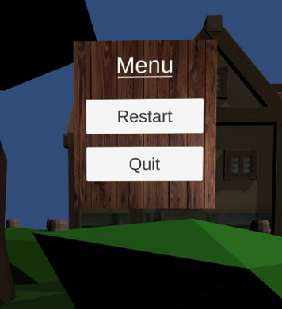

# Project 2: Barrel Bouncer VR Edition

## Part 5: Adjusting the UI

While VR is all about the immersive 3D experience, it may sometimes still be necessary to have 2D UIs, particularly for displaying menus and settings, selecting items, or providing information. By default, Unity UI Canvases render in screen space, which means that they are drawn right on top of the screen over all other objects in the world. However, as we went over in class, you should never have anything within 0.5 meters of the user (i.e. the "No Zone"), since this leads to a very uncomfortable user experience. Additionally, because VR apps use 2+ cameras (one for each eye), screen space UI does not render correctly in VR anyway. As a result, you should always stick to world-space user interfaces when designing virtual reality applications.

For simplicity, in this project you will only be working with a single screen from the Canvas you created in project 1C: the pause menu screen. You will be modifying it to fit our new use case and then adjusting some of its setup to allow input from the Oculus Touch controllers.

### UI Aesthetics & Functionality

For this part, you should delete the regular and game over screens, change your Canvas's _**Render Mode**_ to "World Space", modify your pause menu screen to look like the screenshot below, appropriately size and scale your Canvas, and finally place it somewhere where you can see it. All buttons should have the correct functionality described by their text.

Additionally, when considering scale, remember that world-space UIs work best when they are very large but are scaled down to be very small (think along the lines of 0.01 or 0.001 scale), so you should try to get the general shape of Canvas right first before scaling it down. Note that all other UI elements other than the Canvas should remain at their original scale.



### Enabling Input from VR Controllers

Even though you've finished creating your Canvas, you'll notice that you can't actually interact with it using the Oculus Touch controllers, which kind of defeats the purpose of having a UI in the first place. Luckily, there are some easy ways you can get this interactivity working so that you can actually point at and click on objects in your UI, which you'll get working in this section.


As you work through this part, you may find [this blog post](https://developer.oculus.com/blog/unitys-ui-system-in-vr/) to be a helpful, supplemental resource.

The Oculus Integration provides a great prefab called _**UIHelpers**_, which contain a set of ready-to-use GameObjects that make it easy to interact with UIs with the controllers. It is located in `Assets` -> `Oculus` -> `SampleFramework` -> `Core` -> `DebugUI` -> `Prefabs`. Go ahead and create an instance of this prefab into your scene at the root of the heirarchy, placed at origin.

The _**UIHelpers**_ prefab contains three child GameObjects, each with their own set of important components:

- This prefab contains its own _**EventSystem**_ GameObject. As mentioned in our discussion of UIs during our Unity unit, Event Systems are a way of sending events to objects in the application based on input (i.e. keyboard, mouse, etc.) and are required to use UI Canvases in Unity. However, only one Event System should ever be in a scene, so you should delete all other Event Systems that may have been in the scene from project 1.
  - The _**OVR Input Module**_ is another important component on this GameObject, and Oculus has added this to replace the Standalone Input Module that typically comes with Event Systems in order to support custom input from their controllers. Below are some important properties of the _**OVR Input Module**_:
    - The _**Ray Transform**_ gives a reference to the transform that should be used to determine the point and direction from which to Raycast from in order to determine if a UI is being pointed at and the location on the UI that is being pointed at. In general, this should be one of the controller's transforms, since that is what you use to point at the UIs. However, you do not need to set this yourself, since there is another helper script that automatically sets the reference to the currently active controller's transform.
    - The _**Joy Pad Click Button**_ defines the button(s) that should be used to select objects on the UI. By default, it is set to "One", or the 'A' button on the Oculus Touch controller. However, you generally want to use the triggers for interaction as much as possible since they're more intuitive to use. Thus, you should change this value to instead have both "Primary Index Trigger" and "Secondary Index Trigger" selected. This will allow you to use either the left or right controllers' triggers to click on the buttons in your UI.
- Next, there is a _**LaserPointer**_ GameObject which contains two important components:
  - The _**Line Renderer**_ component is a standard Unity component used to draw a line in 3D space. You already saw a usage of this in the teleportation section.
    - In the current version of the Oculus Integration, it looks like the _**Material**_ for the _**Line Renderer**_ in this prefab is missing. As a result, you should create your own material, set its _**Shader**_ to `Oculus` -> `Unlit`, change the color (if you'd like), and assign this new material to the _**Line Renderer**_.
  - The _**Laser Pointer**_ script basically visualizes the UI Raycast performed by the _**OVR Input Module**_ by appropriately adjusting the starting and ending points of the _**Line Renderer**_ and then moving a small _**Sphere**_ onto the end of the line.
    - You should change its _**Laser Beam Behavior**_ property to _**On When Target Hit**_. This will only show the visualization when the user is actually pointing onto a UI Canvas rather than having the line be present at all times. Note that _**Laser Beam Behavior**_ is a private field in the _**Laser Pointer**_ script, and thus it can't be seen in the Unity Editor by default. Opening up the script and changing the field's access level to public should fix this.
- There is also a simple, small _**Sphere**_ GameObject that is placed at the current "hit point" onto the UI, as described in the last bullet point.

The _**UIHelpers**_ GameObject also contains a script called the _**Handed Input Selector**_, which basically determines the currently active controller and then sets the _**OVR Input Module**_'s _**Ray Transform**_ to that controller's anchor's transform.

Finally, you should go back to your Canvas, replace its _**Graphic Raycaster**_ component with the _**OVR Raycaster**_ component from the Oculus Integration, and then drag in a reference to the _**LaserPointer**_ GameObject into the field for the _**Pointer**_.

### Toggling the Menu

By this point, you should have a fully functioning Canvas that you can interact with. However, you may notice that the Canvas is always present in the scene and always stays in a fixed place. This distracts the user from performing other actions, like teleporting around or throwing balls in the direction of the Canvas. This also means that they have to return to the same spot to select items on the UI even after they have moved away. This makes for a very annoying user experience.

Instead, the menu should not initially be present in the scene, and the user should be able to pull it up right in front of him/her just by clicking a button, regardless of where they have moved to or which direction they are facing. The image below demonstrates this.


Your task for this section is to get the following functionality working via a script on your player (i.e. the OVRCameraRig):

- When the user presses the menu button (which is on the left controller), the menu should appear. When they press the button again, the menu should disappear.
- The menu should appear at a distance of 3 meters away from the user.
- The menu should always be in an upright position and should face the user.
- While the menu is open, it should stay in place. This means that you cannot simply make the Canvas a child of the Camera, since slight jitteriness in user's head movements will make the Canvas jitter as well, which can be distracting, nauseating, and can ultimately make the text hard to read.

_NOTE: You can use the_ **CenterEyeAnchor**_'s Transform to determine current position and rotation of the user._

#### Polling for Input

For this section, you will need to refer to the [Documentation for OVRInput](https://developer.oculus.com/documentation/unity/unity-ovrinput/). It contains some great code examples of how you can obtain input as well as the controller mappings. Since you will be dealing with the menu button on the Touch Controller, you will want to note that it is mapped to `Button.Start`.

As you go through the documentation, you may notice that there are three methods within the _**OVRInput**_ class that you can use to access the state of controller input: `Get()`, `GetDown()`, and `GetUp()`. For buttons, they all return boolean values of whether it is pressed, but under different conditions.

- `GetDown()` only returns true during the frame where the button state has changed from not pressed to pressed.
- `Get()` returns true during all frames where the button is continued to be pressed.
- `GetUp()` returns true only during the frame where the button state has changed from pressed to not pressed (i.e. when it has just been released).

This follows the patterns of many other interactions in Unity that you may have encountered, such as with collisions (OnCollisionEnter, OnCollisionStay, OnCollisionExit).

As you may have done in the past when polling keyboard input, you should poll for controller input within your `Update()` method to check for changes to the button state during each frame.

##### Example

Below is an example code snippet that shows how you might poll for input to determine whether the right Touch controller's "B" button has just been released during the current frame. You will of course need to modify this to fit your own use case.

``` csharp
// Update is called once per frame
void Update()
{
    if (OVRInput.GetUp(OVRInput.Button.Two, OVRInput.Controller.RTouch)
    {
        // Do stuff here
    }
}
```

### Bonus Task (Optional)

Create an "intro scene" with a 360° photo or video, some music, and a world-space UI that stays in place within your scene. The UI could welcome the user to the app, cycle through fun facts about barrels, and allow them to start or exit the game. You will also have to change the UI in your gameplay scene to go back to the intro scene instead of exiting, and you will have to deal with additional scene management. A good first step towards having 360° photos/videos is by placing a sphere in your scene that surrounds the user. Check out [this tutorial](https://youtu.be/hmCxXFY-JHs) on how to use 360° video in Unity. Finally, for the audio, it does not need to persist between scenes, but the sound should originate around the entire sphere rather than from a single point in space. It may be worth completing the next section before attempting this final part.

## [Previous Section](../throw-balls) | [Go Home](..) | [Next Section](../audio)
