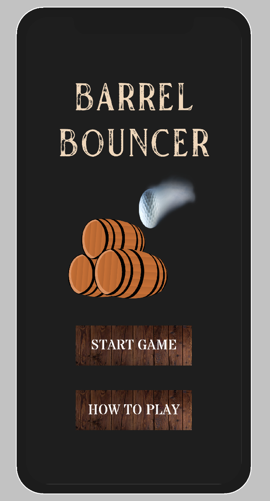
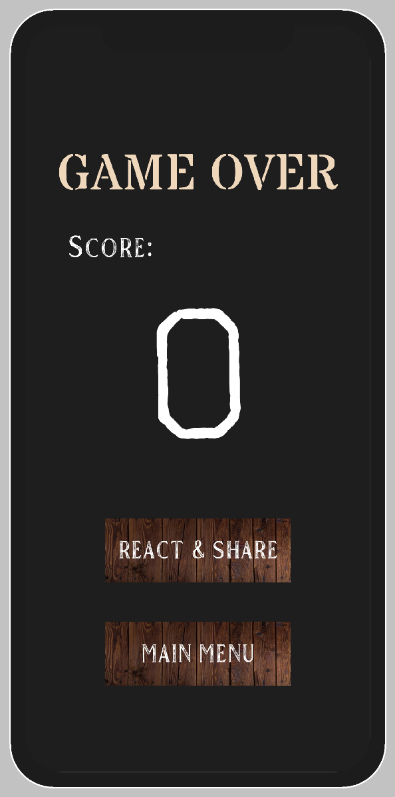

# Project 3: Barrel Bouncer AR Edition

## Part 9: Closing the Game Loop

Now that you've finished creating your main scene, it's time to close the game loop with your other scenes. Specifically, you should have a _**MainMenu**_ scene and a _**GameOver**_ scene. Neither of these will be AR scenes so you don't need to complete the AR Foundation setup for them, but will instead contain the starting and ending menus. The images below depict the general layout for the UIs you should create for each scene:

| Main Menu | Game Over |
| ------------- | ------------- |
|  |  |

For both UIs, you should apply the best practices for designing mobile UIs in Unity. This includes making sure that the UI appropriately scales across all resolutions and that no UI elements appear outside of the safe area. However, the opaque background panel should stretch across the full screen. Check out case study #2 from the article we linked in [Part 7](../phone-uis/#restricting-uis-to-the-safe-area) for more info on how to achieve this effect.

Your _**MainMenu**_ scene can remain the same as the one you created in project 1 if you wish, provided that it adheres to the points made in the last paragraph. However, you would need to change the _**Start Game**_ button to advance to your new AR scene rather than the _**Gameplay**_ scene from project 1.

Your _**GameOver**_ scene should display the score from the most recent run of the game, and should have two buttons. The _**Main Menu**_ button should take you back to _**MainMenu**_ scene when pressed and the _**React & Share**_ button should take you to a new scene that you'll be working with in the next section. Go ahead and get these functionalities working now.

### Bonus Tasks (Optional)

- Revisit all of the UIs you've created for this project and apply some sort of special but consistent theme across them. This may include using custom fonts, having custom buttons, and more. 
- On the _**GameOver**_ screen, have some sort of special congratulatory effect. This may include popping confetti or fireworks across the screen, making the background transition to random bright colors, or some other creative idea you may have.

## [Previous Section](../gameplay-mode) | [Go Home](..) | [Next Section](../share-reaction)
