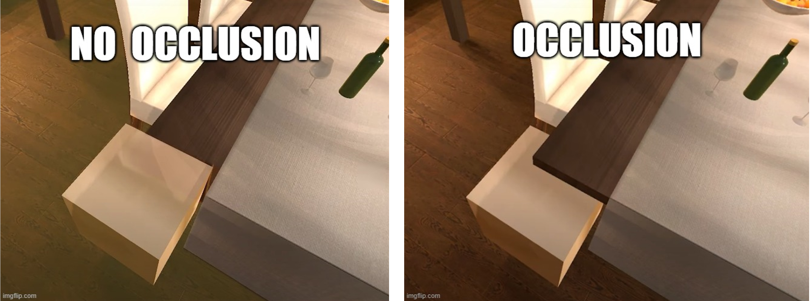

# Project 3: Barrel Bouncer AR Edition

## Part 5: Accounting for Occlusion

As we discussed in class, occlusion in AR refers to the phenomenon where virtual objects can hide behind real things. Achieving occlusion can greatly increase the degree to which virtual objects fit-in into the real environment. Since the main understanding of our world is through planes, we can use them to achieve some limited occlusion effects. The image below shows an example of this with a virtual cube that is placed partially under a dining table.

By default, AR planes in Unity do not account for occlusion. The AR Foundation samples are able to accomplish planar occlusion by applying a transparent material to their planes that only shows the Camera feed background and blocks out all other virtual objects that are behind the plane GameObject. While this material isn't directly provided in the AR Foundation framework (just their sample project), we have included it in the unitypackage you imported earlier.

Open up your _**AR Default Plane**_ prefab and find the _**Materials**_ array of its _**Mesh Renderer**_ component. Increase the size of this array to 2 and drag in the _**OcclusionMaterial**_ to the second element. Your planes should now have both a feathered plane effect and an occlusion effect applied to them.

### Bonus Task (Optional)

With the announcement of iOS 13 and ARKit 3 last June, Apple introduced people occlusion to its augmented reality platform. Below is a video that shows just how well it works in action.

Add this feature into your project as well. You may find the scenes in the Human Segmentation folder of the AR Foundation Samples helpful when implementing this. Note that you will need an iOS device with an A12, A12X, A12Z, or A13 Bionic chip and the Apple Neural Engine to test this out.

## [Previous Section](../set-up-barrels) | [Go Home](..) | [Next Section](../lighting)
