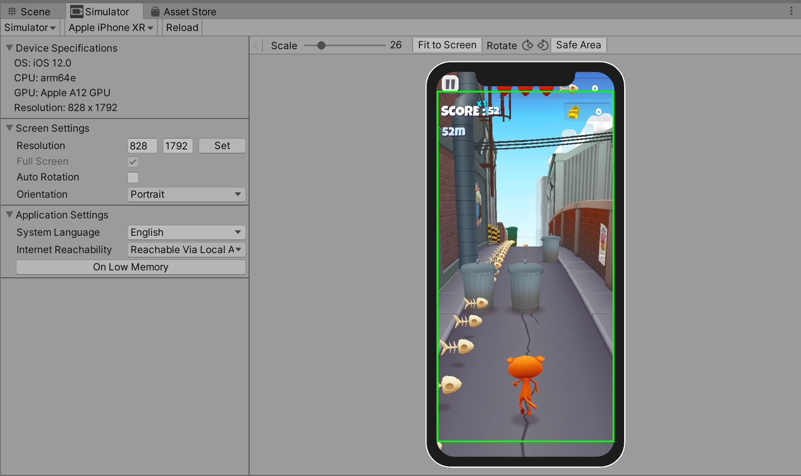
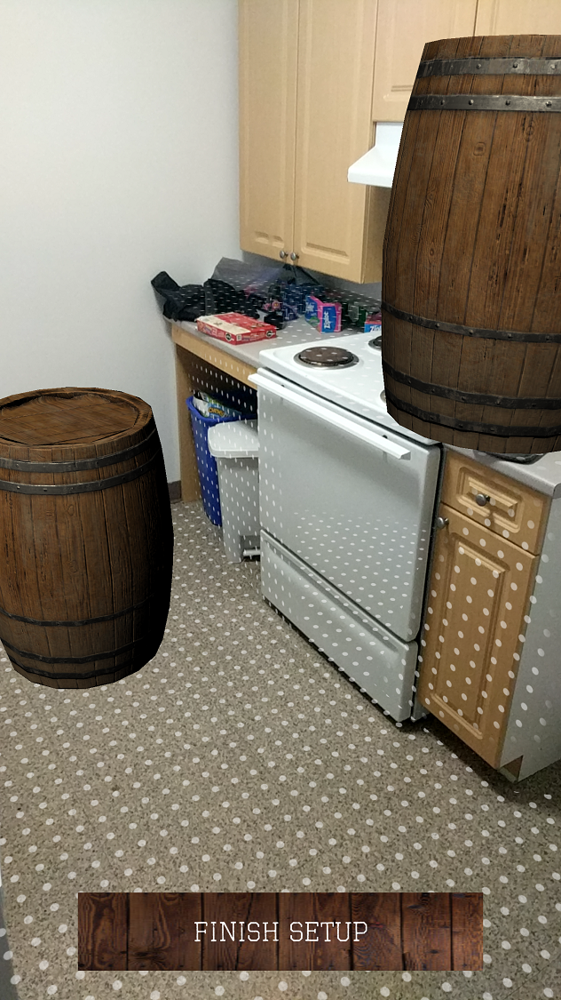
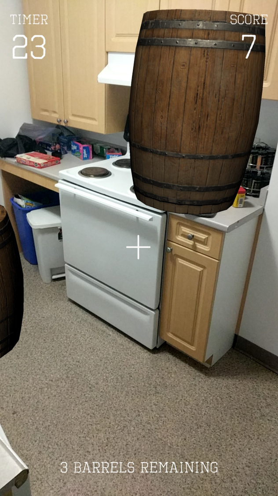

# Project 3: Barrel Bouncer AR Edition

## Part 7: Designing UIs for Phones

In the past, all phone screens had pretty much the exact same size and shape: a simple, flat rectangle. This meant that any UI elements that were contained within the bounds of the screen's resolution were guaranteed to be displayed. However, in recent years, we have begun to see a much greater variety of phone form factors that affect the screen, from rounded corners to curved screens to notches to camera cutouts and more. These present challenges to designing UIs since a UI element anchored to a corner or the top edge could be partially cut out on some devices (but also not others). In this section, you will learn about some tools that you can use to fix this issue and to simulate testing of many different device form factors in order to ensure that your app's UI always displays as you intended.

### The Device Simulator

Unity has developed a new tool called the Device Simulator, which allows you to preview how your app will run and look on different mobile devices from right within the Unity Editor (as shown in the image below). It contains a database of some of the most common phones' specifications and characteristics in order to accomplish this. To learn more about the Device Simulator, check out [this blog post](https://blogs.unity3d.com/2019/09/27/speed-up-mobile-iteration-with-the-new-device-simulator/) and [the tool's documentation](https://docs.unity3d.com/Packages/com.unity.device-simulator@latest/).

The _**Device Simulator**_ is currently available as a preview package in the _**Package Manager**_. Go ahead and install the latest version (`2.2.1` as of this writing). If you need a refresher on how to use the _**Package Manager**_, refer to [part 1](../configuration/#packages-via-the-package-manager).

Once you have installed it, you can access the _**Device Simulator**_ by going into the _**Game View**_ and clicking on the dropdown to switch from _**Game**_ to _**Simulator**_. Then you can select from a variety of different devices to simulate your program running on, including all the latest iPads, iPhones, Samsung Galaxies, Google Pixels, Motorolas, Sonys, and more.

### Restricting UIs to the "Safe Area"

The _**Device Simulator**_ described above provides an easy way to see how your UIs would look on different types of devices and even allows you to highlight the "safe area" of each screen, which is the largest rectangular area of the screen that isn't compromised by physical features or system gestures. In general, you want to keep your UIs within this safe area.

The images below compare a UI that is restricted within the bounds of the safe area with one that just stretches across the entire screen, both in portrait and landscape orientations of an iPhone X.

| Portrait | Landscape |
| ------------- | ------------- |
|  |   |

Unfortunately, the _**Device Simulator**_ itself does not do anything to adjust your UI; it merely helps you with visualization. Instead, Unity leaves it up to you to deal with the logic and modifications to your UI yourself, but does provide access to some helpful properties like [`Screen.safeArea`](https://docs.unity3d.com/ScriptReference/Screen-safeArea.html).

Luckily, someone has already written up a safe area helper script and published it to the Asset Store for anyone to download and use in their own projects. You may obtain it [here](https://assetstore.unity.com/packages/tools/gui/safe-area-helper-130488). You should also check out [this article](https://connect.unity.com/p/updating-your-gui-for-the-iphone-x-and-other-notched-devices) written by its creator, as it goes over three case studies on how to use the tool to achieve a few slightly different effects. Note that the portrait and landscape images above also came from this article.

### Creating the UIs for This Scene

First, begin by adding a _**Canvas**_ into your scene. It should be in _**Screen Space**_ since it will be placed on your screen over everything else. Additionally, you should use the _**Canvas Scaler**_ to ensure that your UI displays correctly on all resolutions. For a _**Reference Resolution**_, you should stick with a fairly common portrait resolution for modern phones, such as 1080 X 1920.

Next, create two empty child GameObjects of this Canvas and rename them to "SetupScreen" and "GameplayScreen". They should both be on the _**UI**_ layer and you should use the anchor presets to stretch their positions across the entire screen. Then you should add the _**Safe Area**_ component onto both of them. This script will automatically create an offset on the relevant sides so that your UI fits inside of the safe area. Note that these adjustments are only made at runtime, which means you need to click the _**Play**_ button in your Editor in order to actually see the changes applied to the UI.

Next, modify each of the two screen's UIs to look like the images below. All UI elements should be child GameObjects of their respective screens and you should make sure to use good anchoring practices and apply appropriate offsets to them.

| Setup Screen | Gameplay Screen |
| ------------- | ------------- |
|  |  |

Specifically, your UI should have the following components and functionality:

- Setup Screen
  - A _**Finish Setup**_ button that switches you from Setup mode to Gameplay mode. Specifically, pressing the button should
    - Hide the _**Setup Screen**_ and show the _**Gameplay Screen**_.
    - Stop the detection of new tap, drag, twist, and pinch gestures so that the user can no longer manipulate the barrels.
      - _**HINT:** This is doable by just disabling a single component._
    - Turn off the highlighted visualization for any barrel that had previously been selected.
    - Stop the detection of new planes, but retain tracking for all currently known planes. You can do this by setting the _**AR Plane Manager**_'s _**Requested Detection Mode**_ to _**None**_.
    - Turn off the feathered plane visualizations for all AR planes in the scene, while also retaining the occlusion effect (so you don't see through the planes). You can accomplish this by iterating over the tracked planes, settting each plane's _**Mesh Renderer**_'s _**Materials**_ to a new array with just the occlusion material, and disabling the _**AR Feathered Plane Mesh Visualizer**_ component from each plane GameObject.
- Gameplay Screen
  - Label and value texts for the timer. The timer should start at 30 and should count down every second once the user has entered Gameplay mode.
  - Label and value texts for the score. This should always be updated to the latest score.
  - Text for number of barrels remaining, once again always updated to reflect the latest value.
  - An aiming reticle in the center to show where you're throwing the ball.

### Bonus Task (Optional)

Currently, there is not much instruction on what users should do in the setup scene, which could leave them confused. The AR Foundation Samples contains a scene called _**SampleUXScene**_ that plays some animations to guide the user on what they should be doing, as shown in the image below.

Since these steps also apply to this app's setup, go ahead and add these same animations to your _**SetupScreen**_. You will need to analyze the sample scene to determine what assets you will need to port over into your project in order to get these guided setup animations to work.

## [Previous Section](../lighting) | [Go Home](..) | [Next Section](../gameplay-mode)
