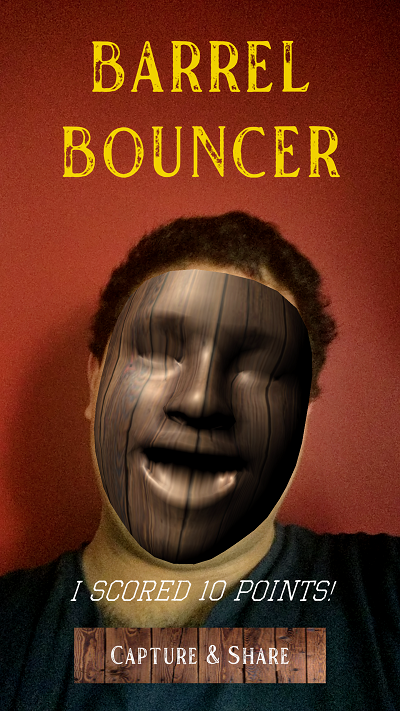

# Project 3: Barrel Bouncer AR Edition

## Part 10: Capturing and Sharing Your Reaction

In this final section, you will work with your _**React & Share**_ scene to capture a screenshot of the user's reaction to their score with a barrel-like filter applied to their face and then allow them to share that screenshot on social media or with friends. As such, you should now open up your _**React & Share**_ scene.

### Creating the Face Filter

The first part of this section is to get the barrel-like face filter working. Follow the steps below to do so.

1. Follow the steps in [part 2](../ar-scene) to set up this scene for AR Foundation.
2. On the _**AR Camera Manager**_ component of your _**AR Camera**_ GameObject, change the _**Facing Direction**_ from _**World**_ to _**User**_. This will change the camera feed to the front-facing camera.
3. To have it recognize the user's face, you should add the _**AR Face Manager**_ component to your _**AR Session Origin**_ GameObject. You will notice that it has two properties that you can set: _**Face Prefab**_ and _**Maximum Face Count**_. The former is a reference to the prefab that the face manager should overlay over the faces it detects.
4. Create the face prefab described in the previous step. On your menu bar, go to `GameObject` -> `XR` -> `AR Default Face`. This will create a new GameObject that defines a default green filter over your face. However, you want to change the filter to be more like your barrels. 
5. Find an image on the Internet that has a similar visual texture to that of your barrel and import it into your project. This will serve as the basis of the face filter.
6. Create a new material, drag your image into the small square box to the left of its _**Albedo**_ property, and then drag that new material into the _**Materials**_ section of the _**Mesh Renderer**_ component of your _**AR Default Face**_ GameObject.
7. Make a prefab out of the  _**AR Default Face**_ GameObject by dragging it into the project window, and then delete any instances of it from your scene. You may rename the prefab for clarity, if you would like.
8. Drag this prefab into the _**Face Prefab**_ slot on the _**AR Face Manager**_.

### Designing the UI

Next, you should create a UI that looks something like this:

### Capturing and Sharing the Screenshot

The final part of this section is to actually capture the screenshot and share it with friends. You should make sure that you are saving the screenshot into a persistent location with a unique filename, so that the screenshots are not overwritten on subsequent runs of the scene. In order to implement the sharing aspect, you should utilize [this plugin from the asset store](https://assetstore.unity.com/packages/tools/integration/native-share-for-android-ios-112731) that will open up your operating system's native sharing manager. The developer of the plugin has also put up [some example code on the project's GitHub page](https://github.com/yasirkula/UnityNativeShare#example-code) that shows how you can implement this functionality. Once you have shared the file, your app should return to your _**MainMenu**_ scene.

## [Previous Section](../game-loop) | [Go Home](..) | [Next Section](../submission)
